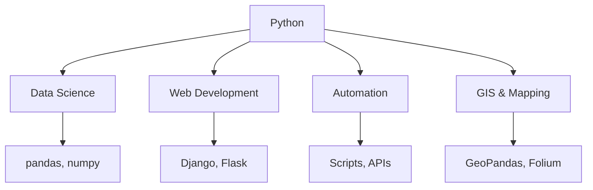

# Module 1: Python Basics

## Learning Goals
- Understand what Python is and where it's used
- Work with variables and basic data types
- Use lists and dictionaries effectively
- Write and use for-loops
- Create simple functions
- Import and use libraries
- Read data with pandas

## What is Python?

Python is a high-level, interpreted programming language that's widely used for:

- **Data Science & Analytics** - pandas, numpy, matplotlib
- **Web Development** - Django, Flask
- **Automation & Scripting** - System administration, data processing
- **Geospatial Analysis** - GeoPandas, Rasterio, Shapely
- **Machine Learning** - scikit-learn, TensorFlow



## 1. Python as a Calculator

Let's start with basic arithmetic operations:

```python
# Basic arithmetic
print(5 + 3)    # Addition: 8
print(10 - 4)   # Subtraction: 6
print(6 * 7)    # Multiplication: 42
print(15 / 3)   # Division: 5.0
print(2 ** 3)   # Exponentiation: 8
print(17 % 5)   # Modulo (remainder): 2
```

!!! tip "Python Calculator Tips"
    - Use `**` for exponentiation (not `^`)
    - Division `/` always returns a float
    - Use `//` for integer division
    - Use `%` to get the remainder

## 2. Variables and Data Types

Variables store data that can be used later:

```python
# Numbers
age = 25
temperature = 23.5
population = 1_000_000  # Underscores for readability

# Strings
city_name = "San Francisco"
country = 'United States'
description = """This is a 
multi-line string"""

# Boolean
is_capital = True
has_data = False

# Check data types
print(type(age))          # <class 'int'>
print(type(temperature))  # <class 'float'>
print(type(city_name))    # <class 'str'>
print(type(is_capital))   # <class 'bool'>
```

### String Operations

```python
# String concatenation and formatting
first_name = "John"
last_name = "Doe"

# Method 1: Concatenation
full_name = first_name + " " + last_name
print(full_name)  # John Doe

# Method 2: f-strings (recommended)
greeting = f"Hello, {first_name}! You are {age} years old."
print(greeting)

# String methods
city = "san francisco"
print(city.title())      # San Francisco
print(city.upper())      # SAN FRANCISCO
print(city.replace(" ", "_"))  # san_francisco
```

## 3. Lists - Ordered Collections

Lists store multiple items in order:

```python
# Creating lists
cities = ["New York", "London", "Tokyo", "Sydney"]
populations = [8_400_000, 9_000_000, 13_960_000, 5_300_000]
mixed_data = ["Paris", 2_161_000, True, 48.8566]

# Accessing elements (0-indexed)
print(cities[0])    # New York (first item)
print(cities[-1])   # Sydney (last item)
print(cities[1:3])  # ['London', 'Tokyo'] (slice)

# Modifying lists
cities.append("Berlin")           # Add to end
cities.insert(1, "Los Angeles")  # Insert at position
cities.remove("Tokyo")           # Remove by value
last_city = cities.pop()         # Remove and return last

# List operations
print(len(cities))              # Number of items
print("London" in cities)       # Check if item exists
print(max(populations))         # Maximum value
print(sum(populations))         # Sum of all values
```

### List Comprehensions (Bonus)

```python
# Create new lists based on existing ones
numbers = [1, 2, 3, 4, 5]
squares = [x**2 for x in numbers]
print(squares)  # [1, 4, 9, 16, 25]

# Filter and transform
large_cities = [city for city in cities if len(city) > 6]
print(large_cities)
```

## 4. Dictionaries - Key-Value Pairs

Dictionaries store data as key-value pairs:

```python
# Creating dictionaries
city_info = {
    "name": "San Francisco",
    "country": "USA",
    "population": 884_000,
    "coordinates": [37.7749, -122.4194],
    "is_capital": False
}

# Accessing values
print(city_info["name"])        # San Francisco
print(city_info.get("population"))  # 884000
print(city_info.get("area", "Unknown"))  # Unknown (default value)

# Modifying dictionaries
city_info["area"] = 121.4  # Add new key-value pair
city_info["population"] = 900_000  # Update existing value

# Dictionary methods
print(city_info.keys())    # All keys
print(city_info.values())  # All values
print(city_info.items())   # Key-value pairs

# Multiple cities
cities_data = {
    "San Francisco": {"population": 884_000, "country": "USA"},
    "London": {"population": 9_000_000, "country": "UK"},
    "Tokyo": {"population": 13_960_000, "country": "Japan"}
}

print(cities_data["London"]["population"])  # 9000000
```

## 5. For Loops - Iteration

For loops let you repeat code for each item in a collection:

```python
# Loop through lists
cities = ["New York", "London", "Tokyo", "Sydney"]

for city in cities:
    print(f"I want to visit {city}")

# Loop with index
for i, city in enumerate(cities):
    print(f"{i+1}. {city}")

# Loop through dictionaries
city_populations = {
    "New York": 8_400_000,
    "London": 9_000_000,
    "Tokyo": 13_960_000
}

# Loop through keys
for city in city_populations:
    print(city)

# Loop through key-value pairs
for city, population in city_populations.items():
    print(f"{city}: {population:,} people")

# Loop through values
for population in city_populations.values():
    print(f"Population: {population:,}")
```

### Range Function

```python
# Generate sequences of numbers
for i in range(5):          # 0, 1, 2, 3, 4
    print(i)

for i in range(1, 6):       # 1, 2, 3, 4, 5
    print(i)

for i in range(0, 10, 2):   # 0, 2, 4, 6, 8
    print(i)

# Practical example: process multiple files
file_numbers = range(1, 6)
for num in file_numbers:
    filename = f"data_{num}.csv"
    print(f"Processing {filename}")
```

## 6. Functions - Reusable Code

Functions help organize and reuse code:

```python
# Simple function
def greet(name):
    """Greet a person by name"""
    return f"Hello, {name}!"

# Call the function
message = greet("Alice")
print(message)  # Hello, Alice!

# Function with multiple parameters
def calculate_density(population, area):
    """Calculate population density"""
    if area == 0:
        return 0
    return population / area

# Function with default parameters
def describe_city(name, population, country="Unknown"):
    """Describe a city with its basic information"""
    density = calculate_density(population, 100)  # Assume 100 km²
    return f"{name} ({country}): {population:,} people, density: {density:.1f}/km²"

# Using functions
sf_info = describe_city("San Francisco", 884_000, "USA")
print(sf_info)

mystery_city = describe_city("Mystery City", 500_000)
print(mystery_city)
```

### Functions with Lists and Dictionaries

```python
def analyze_cities(cities_dict):
    """Analyze a dictionary of cities and their populations"""
    total_population = sum(cities_dict.values())
    largest_city = max(cities_dict, key=cities_dict.get)
    smallest_city = min(cities_dict, key=cities_dict.get)
    
    return {
        "total_population": total_population,
        "largest_city": largest_city,
        "smallest_city": smallest_city,
        "average_population": total_population / len(cities_dict)
    }

# Example usage
cities = {
    "New York": 8_400_000,
    "Los Angeles": 3_900_000,
    "Chicago": 2_700_000,
    "Houston": 2_300_000
}

analysis = analyze_cities(cities)
print(f"Total population: {analysis['total_population']:,}")
print(f"Largest city: {analysis['largest_city']}")
print(f"Average population: {analysis['average_population']:,.0f}")
```

## 7. Importing Libraries

Libraries extend Python's capabilities:

```python
# Import entire modules
import math
import random
from datetime import datetime

# Using imported functions
print(math.sqrt(16))        # 4.0
print(math.pi)              # 3.141592653589793
print(random.randint(1, 10))  # Random number between 1-10
print(datetime.now())       # Current date and time

# Import specific functions
from math import sqrt, pi, sin
print(sqrt(25))  # 5.0

# Import with alias
import pandas as pd
import numpy as np

# These are common conventions in data science
```

## 8. Working with CSV Data using Pandas

Pandas is the most popular library for data analysis:

```python
import pandas as pd

# Create sample data
data = {
    'city': ['New York', 'London', 'Tokyo', 'Sydney', 'Paris'],
    'country': ['USA', 'UK', 'Japan', 'Australia', 'France'],
    'population': [8_400_000, 9_000_000, 13_960_000, 5_300_000, 2_161_000],
    'area_km2': [783, 1572, 2194, 12368, 105]
}

# Create DataFrame
df = pd.DataFrame(data)

# Display data
print("First 3 rows:")
print(df.head(3))

print("\nDataFrame info:")
print(df.info())

print("\nBasic statistics:")
print(df.describe())

# Calculate population density
df['density'] = df['population'] / df['area_km2']

# Filter data
large_cities = df[df['population'] > 5_000_000]
print("\nCities with population > 5 million:")
print(large_cities[['city', 'population']])

# Sort data
df_sorted = df.sort_values('density', ascending=False)
print("\nCities by density (highest first):")
print(df_sorted[['city', 'density']].round(1))

# Group by country (if we had more data)
print(f"\nAverage population: {df['population'].mean():,.0f}")
print(f"Total population: {df['population'].sum():,}")
```

!!! tip "Pandas Tips"
    - Use `df.head()` to see first few rows
    - Use `df.info()` to see data types and missing values
    - Use `df.describe()` for statistical summary
    - Column names with spaces need brackets: `df['column name']`

## Practice Problems

### Problem 1: City Analysis
Create a program that analyzes city data:

```python
# Your task: Complete this code
cities_data = [
    {"name": "Mumbai", "population": 20_400_000, "area": 603},
    {"name": "Delhi", "population": 16_800_000, "area": 1484},
    {"name": "Bangalore", "population": 8_400_000, "area": 709},
    {"name": "Chennai", "population": 7_100_000, "area": 426}
]

# TODO: 
# 1. Calculate population density for each city
# 2. Find the city with highest density
# 3. Calculate average population
# 4. Create a function to format city information nicely

def calculate_city_stats(cities):
    # Your code here
    pass

# Test your function
result = calculate_city_stats(cities_data)
print(result)
```

??? success "Solution"
    ```python
    def calculate_city_stats(cities):
        # Add density to each city
        for city in cities:
            city['density'] = city['population'] / city['area']
        
        # Find highest density city
        highest_density_city = max(cities, key=lambda x: x['density'])
        
        # Calculate average population
        total_pop = sum(city['population'] for city in cities)
        avg_pop = total_pop / len(cities)
        
        return {
            'highest_density_city': highest_density_city['name'],
            'highest_density': highest_density_city['density'],
            'average_population': avg_pop,
            'total_cities': len(cities)
        }
    
    result = calculate_city_stats(cities_data)
    print(f"Highest density: {result['highest_density_city']} ({result['highest_density']:.1f} people/km²)")
    print(f"Average population: {result['average_population']:,.0f}")
    ```

### Problem 2: Data Processing
Work with a list of temperatures:

```python
# Temperature data for a week (in Celsius)
temperatures = [22, 25, 28, 24, 26, 30, 27]
days = ['Monday', 'Tuesday', 'Wednesday', 'Thursday', 'Friday', 'Saturday', 'Sunday']

# TODO:
# 1. Convert all temperatures to Fahrenheit
# 2. Find the hottest and coldest days
# 3. Calculate average temperature
# 4. Count how many days were above 25°C

def analyze_weather(temps, day_names):
    # Your code here
    pass
```

??? success "Solution"
    ```python
    def analyze_weather(temps, day_names):
        # Convert to Fahrenheit
        temps_f = [(temp * 9/5) + 32 for temp in temps]
        
        # Find hottest and coldest days
        hottest_idx = temps.index(max(temps))
        coldest_idx = temps.index(min(temps))
        
        # Calculate average
        avg_temp = sum(temps) / len(temps)
        
        # Count days above 25°C
        hot_days = sum(1 for temp in temps if temp > 25)
        
        return {
            'temperatures_f': temps_f,
            'hottest_day': day_names[hottest_idx],
            'coldest_day': day_names[coldest_idx],
            'average_temp': avg_temp,
            'days_above_25': hot_days
        }
    
    result = analyze_weather(temperatures, days)
    print(f"Hottest day: {result['hottest_day']}")
    print(f"Average temperature: {result['average_temp']:.1f}°C")
    print(f"Days above 25°C: {result['days_above_25']}")
    ```

### Problem 3: Working with Real Data
Create a simple data analysis:

```python
import pandas as pd

# Sample country data
country_data = {
    'country': ['China', 'India', 'USA', 'Indonesia', 'Pakistan', 'Brazil'],
    'population': [1439, 1380, 331, 273, 220, 212],  # millions
    'area': [9596, 3287, 9834, 1905, 881, 8515],     # thousand km²
    'gdp': [14.34, 2.87, 21.43, 1.29, 0.35, 1.61]   # trillion USD
}

# TODO:
# 1. Create a DataFrame
# 2. Calculate population density
# 3. Calculate GDP per capita
# 4. Find the top 3 countries by GDP per capita
# 5. Save results to a new CSV file

# Your code here
```

??? success "Solution"
    ```python
    import pandas as pd
    
    # Create DataFrame
    df = pd.DataFrame(country_data)
    
    # Calculate new columns
    df['pop_density'] = df['population'] / df['area']  # people per km²
    df['gdp_per_capita'] = (df['gdp'] * 1000) / df['population']  # thousands USD
    
    # Find top 3 by GDP per capita
    top_gdp = df.nlargest(3, 'gdp_per_capita')
    
    print("Top 3 countries by GDP per capita:")
    print(top_gdp[['country', 'gdp_per_capita']].round(1))
    
    # Save to CSV
    df.to_csv('country_analysis.csv', index=False)
    print("\nData saved to country_analysis.csv")
    ```

## Key Takeaways

!!! success "What You've Learned"
    - **Variables**: Store and manipulate different types of data
    - **Lists**: Work with ordered collections of items
    - **Dictionaries**: Store key-value pairs for structured data
    - **Loops**: Iterate through data efficiently
    - **Functions**: Create reusable code blocks
    - **Libraries**: Extend Python's capabilities with pandas
    - **Data Analysis**: Basic operations on real-world datasets

!!! tip "Best Practices"
    - Use descriptive variable names: `population` not `p`
    - Comment your code to explain complex logic
    - Use f-strings for string formatting
    - Handle edge cases (like division by zero)
    - Import only what you need from libraries

## Next Steps

In the next module, we'll apply these Python skills to geospatial data, learning about:
- Vector vs Raster data
- Coordinate Reference Systems
- Loading and visualizing geographic data
- Basic GIS concepts through Python

