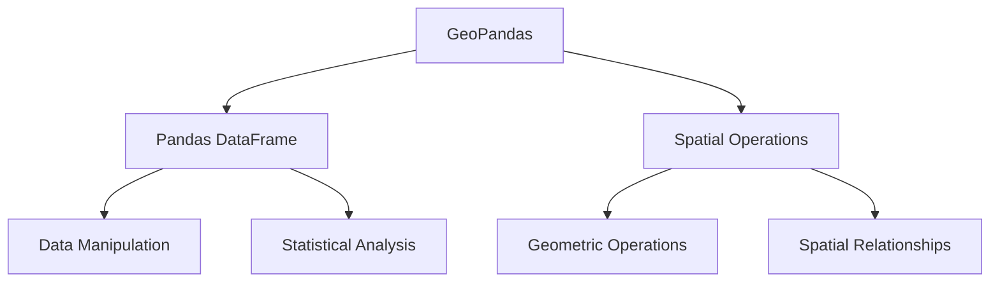
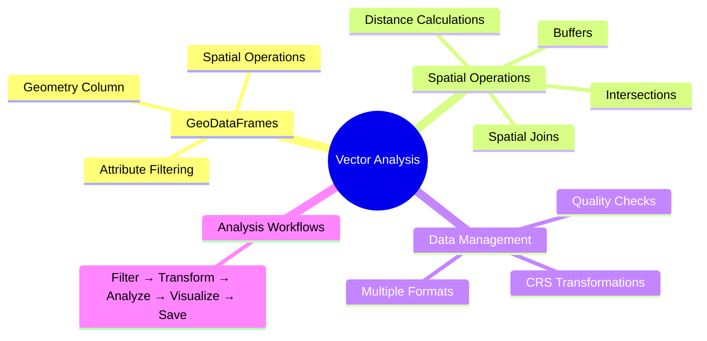
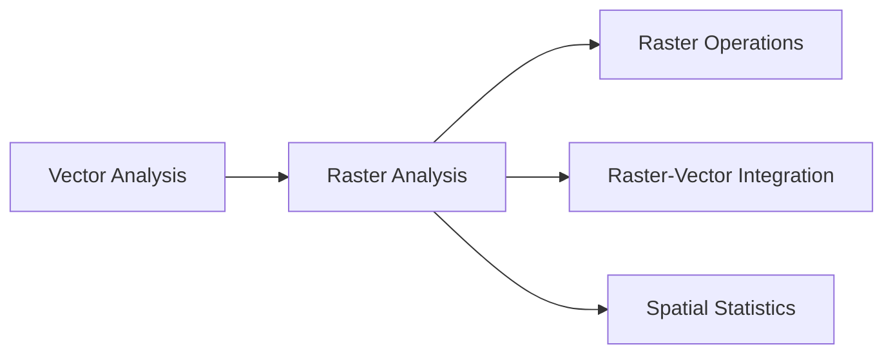

# Module 3: Vector Data & Analysis

## Learning Goals
- Master GeoDataFrames and the geometry column
- Perform spatial operations (buffers, intersections, joins)
- Filter features by attributes and spatial relationships
- Reproject data for accurate analysis
- Save results in various formats
- Create new geographic features

## Introduction to GeoPandas

**GeoPandas** extends pandas to work with geospatial data, combining the power of pandas DataFrames with spatial operations.



## Setting Up the Environment

```python
import geopandas as gpd
import pandas as pd
import matplotlib.pyplot as plt
import numpy as np
from shapely.geometry import Point, LineString, Polygon
import warnings


# Set up plotting
plt.style.use('default')
```

## 1. Understanding GeoDataFrames

A **GeoDataFrame** is like a regular pandas DataFrame but with a special **geometry column**:

```python
# Load Natural Earth data
world = gpd.read_file(gpd.datasets.get_path('naturalearth_lowres'))
cities = gpd.read_file(gpd.datasets.get_path('naturalearth_cities'))

print("=== WORLD COUNTRIES GEODATAFRAME ===")
print(f"Type: {type(world)}")
print(f"Shape: {world.shape}")
print(f"CRS: {world.crs}")
print(f"Geometry column: {world.geometry.name}")

# Inspect the data
print("\n=== COLUMNS ===")
print(world.columns.tolist())

print("\n=== FIRST FEW ROWS ===")
print(world[['name', 'continent', 'pop_est', 'geometry']].head())
```

### The Geometry Column

```python
# Examine geometry types
print("=== GEOMETRY ANALYSIS ===")
print(f"Geometry types: {world.geometry.type.value_counts()}")

# Get geometric properties
print(f"\nTotal bounds: {world.total_bounds}")  # [minx, miny, maxx, maxy]
print(f"Is valid: {world.geometry.is_valid.all()}")

# Individual geometry properties
usa = world[world['name'] == 'United States of America'].iloc[0]
print(f"\nUSA geometry type: {usa.geometry.geom_type}")
print(f"USA bounds: {usa.geometry.bounds}")
print(f"USA area (degrees²): {usa.geometry.area:.2f}")
print(f"USA centroid: {usa.geometry.centroid}")
```

## 2. Loading and Inspecting Vector Data

### Loading Different Data Sources

```python
# Method 1: Natural Earth data (built-in)
world = gpd.read_file(gpd.datasets.get_path('naturalearth_lowres'))
cities = gpd.read_file(gpd.datasets.get_path('naturalearth_cities'))

# Method 2: From URL (example)
# world = gpd.read_file('https://naturalearth.s3.amazonaws.com/110m_cultural/ne_110m_admin_0_countries.zip')

# Method 3: From local file
# world = gpd.read_file('path/to/your/shapefile.shp')
# world = gpd.read_file('path/to/your/geojson.geojson')

print("=== DATA OVERVIEW ===")
print(f"Countries: {len(world)} features")
print(f"Cities: {len(cities)} features")
```

### Data Quality Checks

```python
def inspect_geodataframe(gdf, name):
    """Comprehensive inspection of a GeoDataFrame"""
    print(f"\n=== {name.upper()} INSPECTION ===")
    print(f"Shape: {gdf.shape}")
    print(f"CRS: {gdf.crs}")
    print(f"Geometry types: {gdf.geometry.type.value_counts().to_dict()}")
    print(f"Valid geometries: {gdf.geometry.is_valid.sum()}/{len(gdf)}")
    print(f"Missing values: {gdf.isnull().sum().sum()}")
    print(f"Bounds: {gdf.total_bounds}")
    
    # Check for empty geometries
    empty_geoms = gdf.geometry.is_empty.sum()
    if empty_geoms > 0:
        print(f"⚠️  Empty geometries: {empty_geoms}")
    
    return gdf

# Inspect our datasets
world = inspect_geodataframe(world, "World Countries")
cities = inspect_geodataframe(cities, "Cities")
```

## 3. Attribute-Based Filtering

### Basic Filtering

```python
# Filter by single condition
large_countries = world[world['pop_est'] > 100_000_000]
print(f"Countries with >100M people: {len(large_countries)}")
print(large_countries[['name', 'pop_est']].sort_values('pop_est', ascending=False))

# Filter by multiple conditions
large_rich_countries = world[
    (world['pop_est'] > 50_000_000) & 
    (world['gdp_md_est'] > 1_000_000)
]
print(f"\nLarge & wealthy countries: {len(large_rich_countries)}")

# Filter by continent
asian_countries = world[world['continent'] == 'Asia']
print(f"\nAsian countries: {len(asian_countries)}")

# Filter using isin() for multiple values
developed_continents = world[world['continent'].isin(['Europe', 'North America'])]
print(f"European & North American countries: {len(developed_continents)}")
```

### String Operations

```python
# Countries with 'United' in the name
united_countries = world[world['name'].str.contains('United', na=False)]
print("Countries with 'United' in name:")
print(united_countries['name'].tolist())

# Countries starting with 'S'
s_countries = world[world['name'].str.startswith('S')]
print(f"\nCountries starting with 'S': {len(s_countries)}")

# Case-insensitive search
island_countries = world[world['name'].str.contains('island', case=False, na=False)]
print(f"Countries with 'island' in name: {len(island_countries)}")
```

## 4. Coordinate Reference Systems & Reprojection

### Understanding CRS

```python
print("=== CRS INFORMATION ===")
print(f"World CRS: {world.crs}")
print(f"Cities CRS: {cities.crs}")

# Check if CRS match
if world.crs == cities.crs:
    print("✅ CRS match - safe for spatial operations")
else:
    print("❌ CRS mismatch - need to reproject")
```

### Reprojection for Analysis

```python
# For area calculations, use an equal-area projection
# Mollweide is good for global area calculations
world_equal_area = world.to_crs('+proj=moll')

# Calculate areas in km²
world_equal_area['area_km2_calc'] = world_equal_area.geometry.area / 1_000_000

# Compare with existing area data
comparison = world_equal_area[['name', 'area_km2', 'area_km2_calc']].copy()
comparison['difference'] = abs(comparison['area_km2'] - comparison['area_km2_calc'])

print("=== AREA CALCULATION COMPARISON ===")
print(comparison.sort_values('area_km2_calc', ascending=False).head())
```

### Regional Projections

```python
# For accurate analysis of specific regions, use appropriate projections
# Example: North America in Albers Equal Area Conic
north_america = world[world['continent'] == 'North America']

# Albers Equal Area Conic for North America
na_albers = north_america.to_crs('+proj=aea +lat_1=20 +lat_2=60 +lat_0=40 +lon_0=-96')

# Calculate accurate areas
na_albers['accurate_area'] = na_albers.geometry.area / 1_000_000

print("=== NORTH AMERICA AREAS (Albers projection) ===")
print(na_albers[['name', 'accurate_area']].sort_values('accurate_area', ascending=False))
```

## 5. Spatial Operations

### Buffers

Buffers create zones around features:

```python
# Create buffers around cities
# First, reproject to a projected CRS for accurate distance measurements
cities_projected = cities.to_crs('EPSG:3857')  # Web Mercator (meters)

# Create 100km buffers around cities
cities_100km = cities_projected.copy()
cities_100km['geometry'] = cities_projected.geometry.buffer(100_000)  # 100km in meters

# Reproject back to WGS84 for visualization
cities_100km_wgs84 = cities_100km.to_crs('EPSG:4326')

# Visualize
fig, (ax1, ax2) = plt.subplots(1, 2, figsize=(20, 8))

# Original cities
world.plot(ax=ax1, color='lightgray', edgecolor='black')
cities.plot(ax=ax1, color='red', markersize=20)
ax1.set_title('Original Cities')
ax1.set_xlim(-180, 180)
ax1.set_ylim(-60, 80)

# Cities with buffers
world.plot(ax=ax2, color='lightgray', edgecolor='black')
cities_100km_wgs84.plot(ax=ax2, color='red', alpha=0.3)
cities.plot(ax=ax2, color='red', markersize=10)
ax2.set_title('Cities with 100km Buffers')
ax2.set_xlim(-180, 180)
ax2.set_ylim(-60, 80)

plt.tight_layout()
plt.show()
```

### Spatial Relationships

```python
# Find countries that intersect with city buffers
# This tells us which countries have major cities

# Ensure same CRS
world_proj = world.to_crs('EPSG:3857')
cities_buffers = cities_projected.geometry.buffer(50_000)  # 50km buffers

# Find intersections
countries_with_major_cities = []

for idx, country in world_proj.iterrows():
    # Check if any city buffer intersects with this country
    intersects = cities_buffers.intersects(country.geometry).any()
    if intersects:
        countries_with_major_cities.append(country['name'])

print(f"Countries with major cities (within 50km): {len(countries_with_major_cities)}")
print(f"Countries without major cities: {len(world) - len(countries_with_major_cities)}")
```

## Spatial Relationships & Functions

Understanding spatial relationships is crucial for geospatial analysis. Here's a comprehensive guide to spatial predicates and their use cases:

| Spatial Predicate | Description | Use Cases | Example |
|------------------|-------------|-----------|----------|
| **intersects** | Geometries share at least one point | General overlap detection, finding features that touch or overlap | Roads intersecting with flood zones |
| **within** | Geometry A is completely inside geometry B | Point-in-polygon analysis, containment queries | Cities within countries, buildings within parcels |
| **contains** | Geometry A completely contains geometry B | Reverse containment, administrative boundaries | Countries containing cities, parks containing facilities |
| **touches** | Geometries share boundary but no interior points | Adjacent features, boundary analysis | Adjacent land parcels, neighboring countries |
| **crosses** | Geometries intersect but neither contains the other | Linear features crossing areas | Rivers crossing administrative boundaries |
| **overlaps** | Geometries share some but not all points | Partial overlap analysis | Overlapping service areas, competing territories |
| **disjoint** | Geometries share no points | Isolation analysis, gap detection | Non-adjacent properties, isolated habitats |
| **equals** | Geometries are spatially equal | Duplicate detection, exact matching | Identical boundary definitions |
| **covers** | Geometry A covers geometry B (includes boundary) | Coverage analysis with boundaries | Service areas covering demand points |
| **covered_by** | Geometry A is covered by geometry B | Reverse coverage analysis | Facilities covered by service areas |

### Point-in-Polygon Operations

```python
# Find which country each city belongs to
cities_with_countries = gpd.sjoin(cities, world, how='left', predicate='within')

print("=== CITIES WITH THEIR COUNTRIES ===")
city_country_check = cities_with_countries[['name_left', 'name_right']].copy()
city_country_check.columns = ['city', 'country']
print(city_country_check.head(10))

# Count cities per country
cities_per_country = city_country_check['country'].value_counts()
print(f"\nTop 10 countries by number of major cities:")
print(cities_per_country.head(10))
```

## 6. Geometric Calculations

### Distance Calculations

```python
# Calculate distances between cities
from shapely.geometry import Point

# Select a few major cities
major_cities = cities[cities['name'].isin(['New York', 'London', 'Tokyo', 'Sydney'])].copy()

# Reproject for accurate distance calculation
major_cities_proj = major_cities.to_crs('EPSG:3857')

# Calculate distance matrix
city_names = major_cities['name'].tolist()
distances = {}

for i, city1 in major_cities_proj.iterrows():
    distances[city1['name']] = {}
    for j, city2 in major_cities_proj.iterrows():
        if city1['name'] != city2['name']:
            dist_m = city1.geometry.distance(city2.geometry)
            dist_km = dist_m / 1000
            distances[city1['name']][city2['name']] = dist_km

# Display distance matrix
print("=== DISTANCE MATRIX (km) ===")
import pandas as pd
distance_df = pd.DataFrame(distances).fillna(0)
print(distance_df.round(0))
```

### Area and Perimeter

```python
# Calculate country statistics
world_stats = world.to_crs('+proj=moll').copy()  # Equal area projection

# Calculate geometric properties
world_stats['area_km2'] = world_stats.geometry.area / 1_000_000
world_stats['perimeter_km'] = world_stats.geometry.length / 1_000
world_stats['compactness'] = (4 * np.pi * world_stats['area_km2']) / (world_stats['perimeter_km'] ** 2)

# Display results
print("=== COUNTRY GEOMETRIC STATISTICS ===")
stats_display = world_stats[['name', 'area_km2', 'perimeter_km', 'compactness']].copy()
stats_display = stats_display.sort_values('area_km2', ascending=False)

print("Largest countries by area:")
print(stats_display.head())

print("\nMost compact countries (closer to 1 = more circular):")
print(stats_display.sort_values('compactness', ascending=False).head())
```

## 7. Spatial Joins

### Joining Based on Spatial Relationships

```python
# Create a more detailed spatial join
# Find all cities within each country and calculate statistics

# Perform spatial join
cities_in_countries = gpd.sjoin(cities, world, how='left', predicate='within')

# Calculate statistics per country
country_stats = cities_in_countries.groupby('name_right').agg({
    'name_left': 'count',  # Number of cities
    'pop_est_left': ['sum', 'mean']  # Total and average city population
}).round(0)

# Flatten column names
country_stats.columns = ['num_cities', 'total_city_pop', 'avg_city_pop']
country_stats = country_stats.sort_values('num_cities', ascending=False)

print("=== COUNTRIES WITH MOST MAJOR CITIES ===")
print(country_stats.head(10))

# Merge back with world data for visualization
world_with_cities = world.merge(country_stats, left_on='name', right_index=True, how='left')
world_with_cities['num_cities'] = world_with_cities['num_cities'].fillna(0)
```

### Visualizing Spatial Joins

```python
# Create a choropleth map showing number of major cities per country
fig, ax = plt.subplots(1, 1, figsize=(20, 12))

world_with_cities.plot(
    column='num_cities',
    cmap='YlOrRd',
    legend=True,
    ax=ax,
    edgecolor='black',
    linewidth=0.5,
    legend_kwds={'label': 'Number of Major Cities'}
)

cities.plot(ax=ax, color='blue', markersize=15, alpha=0.7)

ax.set_title('Countries by Number of Major Cities', fontsize=16, fontweight='bold')
ax.set_xlim(-180, 180)
ax.set_ylim(-60, 80)
ax.axis('off')

plt.tight_layout()
plt.show()
```

## 8. Creating New Geometries

### Creating Points from Coordinates

```python
# Create new cities from coordinate data
new_cities_data = {
    'name': ['Mumbai', 'São Paulo', 'Cairo', 'Lagos'],
    'country': ['India', 'Brazil', 'Egypt', 'Nigeria'],
    'latitude': [19.0760, -23.5505, 30.0444, 6.5244],
    'longitude': [72.8777, -46.6333, 31.2357, 3.3792],
    'population': [20_400_000, 12_300_000, 10_200_000, 14_900_000]
}

# Create GeoDataFrame
new_cities_df = pd.DataFrame(new_cities_data)
geometry = [Point(xy) for xy in zip(new_cities_df.longitude, new_cities_df.latitude)]
new_cities_gdf = gpd.GeoDataFrame(new_cities_df, geometry=geometry, crs='EPSG:4326')

print("=== NEW CITIES CREATED ===")
print(new_cities_gdf)
```

### Creating Lines and Polygons

```python
# Create flight routes (lines) between cities
from shapely.geometry import LineString

# Define some flight routes
routes = [
    {'from': 'New York', 'to': 'London', 'from_coords': [-74.0060, 40.7128], 'to_coords': [-0.1276, 51.5074]},
    {'from': 'Tokyo', 'to': 'Sydney', 'from_coords': [139.6917, 35.6895], 'to_coords': [151.2093, -33.8688]},
    {'from': 'Mumbai', 'to': 'Dubai', 'from_coords': [72.8777, 19.0760], 'to_coords': [55.2708, 25.2048]}
]

# Create flight route geometries
route_geometries = []
route_info = []

for route in routes:
    line = LineString([route['from_coords'], route['to_coords']])
    route_geometries.append(line)
    route_info.append({
        'route': f"{route['from']} - {route['to']}",
        'from_city': route['from'],
        'to_city': route['to']
    })

# Create GeoDataFrame for routes
routes_gdf = gpd.GeoDataFrame(route_info, geometry=route_geometries, crs='EPSG:4326')

print("=== FLIGHT ROUTES CREATED ===")
print(routes_gdf)

# Visualize
fig, ax = plt.subplots(1, 1, figsize=(15, 10))
world.plot(ax=ax, color='lightgray', edgecolor='black')
routes_gdf.plot(ax=ax, color='red', linewidth=2, alpha=0.7)
cities.plot(ax=ax, color='blue', markersize=30, alpha=0.8)
ax.set_title('World Map with Flight Routes')
ax.set_xlim(-180, 180)
ax.set_ylim(-60, 80)
plt.show()
```

## 9. Saving Results

### Different Output Formats

```python
# Save to different formats
output_dir = 'output/'

# Create output directory (in real scenario)
# import os
# os.makedirs(output_dir, exist_ok=True)

# 1. GeoJSON (web-friendly)
large_countries.to_file(f'{output_dir}large_countries.geojson', driver='GeoJSON')

# 2. Shapefile (traditional GIS format)
large_countries.to_file(f'{output_dir}large_countries.shp')

# 3. GeoPackage (modern, efficient)
large_countries.to_file(f'{output_dir}analysis_results.gpkg', layer='large_countries')
cities_100km_wgs84.to_file(f'{output_dir}analysis_results.gpkg', layer='city_buffers')

# 4. CSV with WKT geometry (for databases)
large_countries_csv = large_countries.copy()
large_countries_csv['geometry_wkt'] = large_countries_csv.geometry.to_wkt()
large_countries_csv.drop('geometry', axis=1).to_csv(f'{output_dir}large_countries.csv', index=False)

print("=== FILES SAVED ===")
print("✅ large_countries.geojson")
print("✅ large_countries.shp (+ associated files)")
print("✅ analysis_results.gpkg (multiple layers)")
print("✅ large_countries.csv (with WKT geometry)")
```

## Practice Problems

### Problem 1: European Analysis
Analyze European countries in detail:

```python
# TODO:
# 1. Filter European countries
# 2. Find the most populous European country
# 3. Calculate total European population
# 4. Find European countries with coastlines (hint: use geometry.length)
# 5. Create buffers around European countries
# 6. Save results to GeoJSON

# Your code here
```

??? success "Solution"
    ```python
    # 1. Filter European countries
    europe = world[world['continent'] == 'Europe'].copy()
    print(f"European countries: {len(europe)}")
    
    # 2. Most populous European country
    most_populous = europe.loc[europe['pop_est'].idxmax()]
    print(f"Most populous: {most_populous['name']} ({most_populous['pop_est']:,})")
    
    # 3. Total European population
    total_pop = europe['pop_est'].sum()
    print(f"Total European population: {total_pop:,}")
    
    # 4. Countries with coastlines (longer perimeter suggests coastline)
    europe_proj = europe.to_crs('EPSG:3857')  # Project for accurate length
    europe_proj['perimeter_km'] = europe_proj.geometry.length / 1000
    
    # Countries with long coastlines (>5000km perimeter)
    coastal_countries = europe_proj[europe_proj['perimeter_km'] > 5000]
    print(f"Countries with long coastlines:")
    print(coastal_countries[['name', 'perimeter_km']].sort_values('perimeter_km', ascending=False))
    
    # 5. Create 200km buffers
    europe_buffers = europe_proj.copy()
    europe_buffers['geometry'] = europe_proj.geometry.buffer(200_000)
    europe_buffers = europe_buffers.to_crs('EPSG:4326')
    
    # 6. Save results
    europe.to_file('europe_analysis.geojson', driver='GeoJSON')
    europe_buffers.to_file('europe_buffers.geojson', driver='GeoJSON')
    
    # Visualize
    fig, (ax1, ax2) = plt.subplots(1, 2, figsize=(20, 8))
    
    europe.plot(ax=ax1, color='lightblue', edgecolor='black')
    ax1.set_title('European Countries')
    
    europe_buffers.plot(ax=ax2, color='red', alpha=0.3)
    europe.plot(ax=ax2, color='lightblue', edgecolor='black')
    ax2.set_title('European Countries with 200km Buffers')
    
    plt.tight_layout()
    plt.show()
    ```

### Problem 2: City-Country Analysis
Perform detailed analysis of cities and their countries:

```python
# TODO:
# 1. Find cities that are NOT in any country (spatial join issues)
# 2. Calculate the average distance between cities in the same country
# 3. Find the country with cities spread over the largest area
# 4. Create convex hulls around cities for each country
# 5. Identify island nations (countries with no land borders)

# Your code here
```

??? success "Solution"
    ```python
    # 1. Cities not in any country
    cities_countries = gpd.sjoin(cities, world, how='left', predicate='within')
    orphan_cities = cities_countries[cities_countries['name_right'].isna()]
    print(f"Cities not in any country: {len(orphan_cities)}")
    if len(orphan_cities) > 0:
        print(orphan_cities[['name_left', 'geometry']])
    
    # 2. Average distance between cities in same country
    from itertools import combinations
    
    cities_with_country = cities_countries.dropna(subset=['name_right'])
    country_distances = {}
    
    for country in cities_with_country['name_right'].unique():
        country_cities = cities_with_country[cities_with_country['name_right'] == country]
        if len(country_cities) > 1:
            # Project for accurate distance
            country_cities_proj = country_cities.to_crs('EPSG:3857')
            distances = []
            
            for city1, city2 in combinations(country_cities_proj.itertuples(), 2):
                dist = city1.geometry.distance(city2.geometry) / 1000  # km
                distances.append(dist)
            
            if distances:
                country_distances[country] = np.mean(distances)
    
    # Sort by average distance
    sorted_distances = sorted(country_distances.items(), key=lambda x: x[1], reverse=True)
    print("\nCountries with largest average distances between cities:")
    for country, avg_dist in sorted_distances[:5]:
        print(f"{country}: {avg_dist:.0f} km")
    
    # 3. Country with cities spread over largest area
    country_spreads = {}
    for country in cities_with_country['name_right'].unique():
        country_cities = cities_with_country[cities_with_country['name_right'] == country]
        if len(country_cities) > 1:
            # Calculate bounding box area
            bounds = country_cities.total_bounds
            width = bounds[2] - bounds[0]  # max_x - min_x
            height = bounds[3] - bounds[1]  # max_y - min_y
            area = width * height
            country_spreads[country] = area
    
    largest_spread = max(country_spreads.items(), key=lambda x: x[1])
    print(f"\nCountry with most spread out cities: {largest_spread[0]}")
    
    # 4. Convex hulls around cities for each country
    from shapely.geometry import MultiPoint
    
    country_hulls = []
    for country in cities_with_country['name_right'].unique():
        country_cities = cities_with_country[cities_with_country['name_right'] == country]
        if len(country_cities) >= 3:  # Need at least 3 points for convex hull
            points = MultiPoint(country_cities.geometry.tolist())
            hull = points.convex_hull
            country_hulls.append({
                'country': country,
                'geometry': hull,
                'num_cities': len(country_cities)
            })
    
    hulls_gdf = gpd.GeoDataFrame(country_hulls, crs='EPSG:4326')
    print(f"\nCreated convex hulls for {len(hulls_gdf)} countries")
    
    # 5. Island nations (simplified approach - countries with small perimeter relative to area)
    world_proj = world.to_crs('EPSG:3857')
    world_proj['area_km2'] = world_proj.geometry.area / 1_000_000
    world_proj['perimeter_km'] = world_proj.geometry.length / 1_000
    world_proj['perimeter_area_ratio'] = world_proj['perimeter_km'] / world_proj['area_km2']
    
    # Island nations typically have high perimeter to area ratios
    potential_islands = world_proj[world_proj['perimeter_area_ratio'] > 1.0]
    potential_islands = potential_islands.sort_values('perimeter_area_ratio', ascending=False)
    
    print(f"\nPotential island nations (high perimeter/area ratio):")
    print(potential_islands[['name', 'perimeter_area_ratio']].head(10))
    ```

### Problem 3: Advanced Spatial Analysis
Create a comprehensive analysis combining multiple operations:

```python
# TODO:
# 1. Find all countries within 1000km of a specific city (e.g., London)
# 2. Calculate which percentage of each country's area is within this buffer
# 3. Create a "sphere of influence" analysis
# 4. Visualize the results with different colors based on influence level

# Your code here
```

??? success "Solution"
    ```python
    # 1. Find countries within 1000km of London
    london = cities[cities['name'] == 'London'].iloc[0]
    
    # Project to equal area for accurate buffer
    london_proj = gpd.GeoDataFrame([london], crs='EPSG:4326').to_crs('EPSG:3857')
    london_buffer = london_proj.geometry.buffer(1_000_000).iloc[0]  # 1000km
    
    # Convert back to WGS84
    london_buffer_wgs84 = gpd.GeoDataFrame([{'geometry': london_buffer}], crs='EPSG:3857').to_crs('EPSG:4326')
    
    # Find intersecting countries
    world_proj = world.to_crs('EPSG:3857')
    london_buffer_proj = gpd.GeoDataFrame([{'geometry': london_buffer}], crs='EPSG:3857')
    
    # Calculate intersections and percentages
    influence_analysis = []
    
    for idx, country in world_proj.iterrows():
        intersection = country.geometry.intersection(london_buffer)
        if not intersection.is_empty:
            intersection_area = intersection.area / 1_000_000  # km²
            country_area = country.geometry.area / 1_000_000  # km²
            percentage = (intersection_area / country_area) * 100
            
            influence_analysis.append({
                'country': country['name'],
                'intersection_area_km2': intersection_area,
                'country_area_km2': country_area,
                'percentage_in_buffer': percentage,
                'geometry': country.geometry
            })
    
    # Create GeoDataFrame
    influence_gdf = gpd.GeoDataFrame(influence_analysis, crs='EPSG:3857')
    influence_gdf = influence_gdf.to_crs('EPSG:4326')
    
    # Categorize influence levels
    influence_gdf['influence_level'] = pd.cut(
        influence_gdf['percentage_in_buffer'],
        bins=[0, 25, 50, 75, 100],
        labels=['Low (0-25%)', 'Medium (25-50%)', 'High (50-75%)', 'Very High (75-100%)']
    )
    
    print("=== LONDON'S SPHERE OF INFLUENCE ===")
    print(influence_gdf[['country', 'percentage_in_buffer', 'influence_level']].sort_values('percentage_in_buffer', ascending=False))
    
    # Visualize
    fig, ax = plt.subplots(1, 1, figsize=(15, 12))
    
    # Plot world in gray
    world.plot(ax=ax, color='lightgray', edgecolor='black', alpha=0.5)
    
    # Plot influenced countries with color coding
    colors = {'Low (0-25%)': 'yellow', 'Medium (25-50%)': 'orange', 
              'High (50-75%)': 'red', 'Very High (75-100%)': 'darkred'}
    
    for level in influence_gdf['influence_level'].unique():
        if pd.notna(level):
            subset = influence_gdf[influence_gdf['influence_level'] == level]
            subset.plot(ax=ax, color=colors[level], label=level, alpha=0.7, edgecolor='black')
    
    # Plot London buffer
    london_buffer_wgs84.plot(ax=ax, color='none', edgecolor='blue', linewidth=2, linestyle='--', alpha=0.8)
    
    # Plot London
    gpd.GeoDataFrame([london], crs='EPSG:4326').plot(ax=ax, color='blue', markersize=100, marker='*')
    
    ax.set_title("London's 1000km Sphere of Influence", fontsize=16, fontweight='bold')
    ax.legend(loc='upper left')
    ax.set_xlim(-20, 40)
    ax.set_ylim(35, 70)
    
    plt.tight_layout()
    plt.show()
    
    # Save results
    influence_gdf.to_file('london_influence.geojson', driver='GeoJSON')
    ```

## Key Takeaways



!!! success "What You've Learned"
    - **GeoDataFrames**: The foundation of spatial data analysis in Python
    - **Spatial Operations**: Buffers, intersections, and spatial relationships
    - **Attribute Filtering**: Query data based on properties
    - **CRS Management**: Transform data for accurate analysis
    - **Geometric Calculations**: Areas, distances, and spatial statistics
    - **Data Export**: Save results in various formats

!!! tip "Best Practices"
    - Always check and align CRS before spatial operations
    - Use appropriate projections for your analysis type
    - Validate geometries before complex operations
    - Document your analysis workflow
    - Save intermediate results for debugging
    - Visualize data at each step to catch errors

## Next Steps

In the next module, we'll explore raster data analysis:
- Loading and inspecting raster datasets
- Raster-vector interactions
- Raster calculations and statistics
- Clipping and masking operations
- Combining raster and vector analysis

