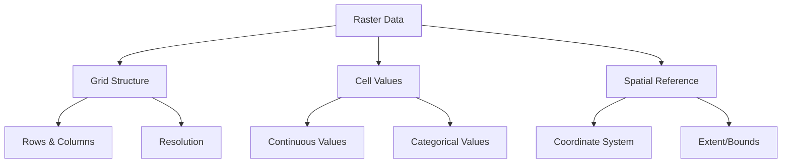
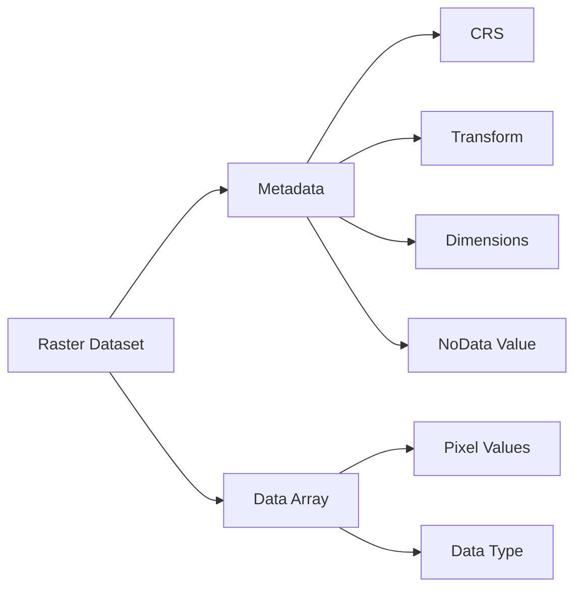
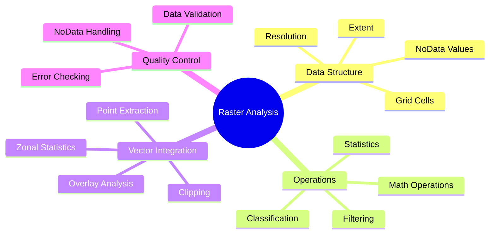
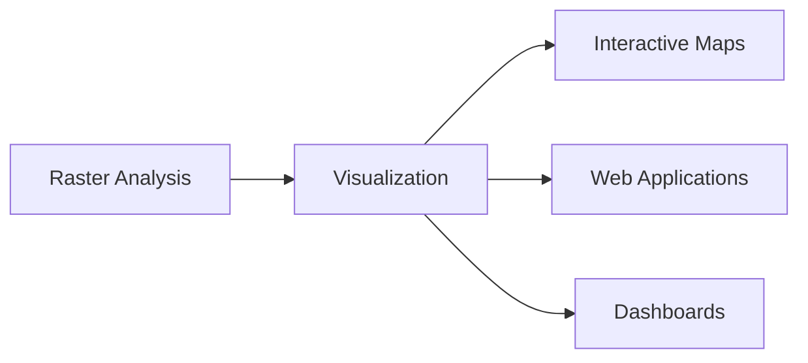

# Module 4: Raster Data & Analysis

## Learning Goals
- Understand raster data structure and properties
- Load and inspect raster files with rasterio
- Perform raster calculations and statistics
- Clip rasters using vector boundaries
- Combine raster and vector data analysis
- Handle NoData values and data types

## Introduction to Raster Data

**Raster data** represents continuous phenomena as a grid of cells (pixels), where each cell contains a value representing some measurement or classification.



### Common Raster Data Types
- **Elevation models** (DEMs) - terrain height
- **Satellite imagery** - multispectral data
- **Climate data** - temperature, precipitation
- **Population density** - people per area
- **Land cover** - vegetation, urban areas

## Setting Up the Environment

```python
import rasterio
import rasterio.plot
import rasterio.mask
import numpy as np
import matplotlib.pyplot as plt
import geopandas as gpd
from rasterio.warp import calculate_default_transform, reproject, Resampling
from rasterio.windows import from_bounds
import warnings
warnings.filterwarnings('ignore')

# Set up plotting
plt.style.use('default')
```

## 1. Understanding Raster Structure

### Raster Components



### Creating Sample Raster Data

Since we're working in a cloud environment, let's create sample raster data to demonstrate concepts:

```python
# Create sample elevation data
def create_sample_elevation(width=100, height=100):
    """Create a sample elevation raster"""
    # Create coordinate grids
    x = np.linspace(-10, 10, width)
    y = np.linspace(-10, 10, height)
    X, Y = np.meshgrid(x, y)
    
    # Create elevation surface (combination of functions)
    elevation = (
        1000 * np.exp(-(X**2 + Y**2) / 20) +  # Central peak
        500 * np.sin(X/2) * np.cos(Y/2) +     # Rolling hills
        200 * np.random.random((height, width)) # Random noise
    )
    
    return elevation.astype(np.float32)

# Create sample data
elevation_data = create_sample_elevation(200, 150)

print("=== SAMPLE ELEVATION DATA ===")
print(f"Shape: {elevation_data.shape}")
print(f"Data type: {elevation_data.dtype}")
print(f"Min elevation: {elevation_data.min():.1f}m")
print(f"Max elevation: {elevation_data.max():.1f}m")
print(f"Mean elevation: {elevation_data.mean():.1f}m")
```

### Raster Metadata and Transform

```python
from rasterio.transform import from_bounds

# Define spatial properties for our sample data
bounds = (-10, -10, 10, 10)  # (left, bottom, right, top)
height, width = elevation_data.shape
transform = from_bounds(*bounds, width, height)

print("=== RASTER SPATIAL PROPERTIES ===")
print(f"Bounds: {bounds}")
print(f"Transform: {transform}")
print(f"Pixel size X: {transform[0]:.4f}")
print(f"Pixel size Y: {abs(transform[4]):.4f}")

# Calculate pixel coordinates
def pixel_to_coord(row, col, transform):
    """Convert pixel coordinates to geographic coordinates"""
    x = transform[0] * col + transform[1] * row + transform[2]
    y = transform[3] * col + transform[4] * row + transform[5]
    return x, y

# Example: center pixel coordinates
center_row, center_col = height // 2, width // 2
center_x, center_y = pixel_to_coord(center_row, center_col, transform)
print(f"Center pixel ({center_row}, {center_col}) = ({center_x:.2f}, {center_y:.2f})")
```

## 2. Visualizing Raster Data

### Basic Raster Visualization

```python
# Create comprehensive visualization
fig, axes = plt.subplots(2, 2, figsize=(15, 12))

# 1. Basic elevation map
im1 = axes[0,0].imshow(elevation_data, cmap='terrain', extent=bounds)
axes[0,0].set_title('Elevation Map')
axes[0,0].set_xlabel('Longitude')
axes[0,0].set_ylabel('Latitude')
plt.colorbar(im1, ax=axes[0,0], label='Elevation (m)')

# 2. Hillshade effect
from matplotlib.colors import LightSource
ls = LightSource(azdeg=315, altdeg=45)
hillshade = ls.hillshade(elevation_data, vert_exag=2)
axes[0,1].imshow(hillshade, cmap='gray', extent=bounds)
axes[0,1].set_title('Hillshade')
axes[0,1].set_xlabel('Longitude')
axes[0,1].set_ylabel('Latitude')

# 3. Elevation histogram
axes[1,0].hist(elevation_data.flatten(), bins=50, alpha=0.7, color='brown')
axes[1,0].set_title('Elevation Distribution')
axes[1,0].set_xlabel('Elevation (m)')
axes[1,0].set_ylabel('Frequency')
axes[1,0].grid(True, alpha=0.3)

# 4. Contour lines
contour = axes[1,1].contour(elevation_data, levels=10, extent=bounds, colors='black', alpha=0.6)
axes[1,1].clabel(contour, inline=True, fontsize=8)
im4 = axes[1,1].imshow(elevation_data, cmap='terrain', extent=bounds, alpha=0.7)
axes[1,1].set_title('Elevation with Contours')
axes[1,1].set_xlabel('Longitude')
axes[1,1].set_ylabel('Latitude')

plt.tight_layout()
plt.show()
```

### Advanced Visualization Techniques

```python
# Create elevation classes
def classify_elevation(elevation, breaks):
    """Classify elevation into categories"""
    classified = np.zeros_like(elevation, dtype=np.int32)
    for i, break_val in enumerate(breaks[1:], 1):
        classified[elevation <= break_val] = i
    return classified

# Define elevation breaks
elevation_breaks = [0, 200, 500, 800, 1200, 2000]
elevation_classes = classify_elevation(elevation_data, elevation_breaks)

# Create custom colormap
colors = ['#2E8B57', '#9ACD32', '#DAA520', '#CD853F', '#A0522D', '#FFFFFF']
from matplotlib.colors import ListedColormap
custom_cmap = ListedColormap(colors[:len(elevation_breaks)-1])

# Plot classified elevation
fig, (ax1, ax2) = plt.subplots(1, 2, figsize=(15, 6))

# Original continuous elevation
im1 = ax1.imshow(elevation_data, cmap='terrain', extent=bounds)
ax1.set_title('Continuous Elevation')
plt.colorbar(im1, ax=ax1, label='Elevation (m)')

# Classified elevation
im2 = ax2.imshow(elevation_classes, cmap=custom_cmap, extent=bounds)
ax2.set_title('Classified Elevation')
cbar = plt.colorbar(im2, ax=ax2, ticks=range(len(elevation_breaks)-1))
cbar.set_ticklabels([f'{elevation_breaks[i]}-{elevation_breaks[i+1]}m' 
                     for i in range(len(elevation_breaks)-1)])

plt.tight_layout()
plt.show()
```

## 3. Raster Calculations and Statistics

### Basic Statistics

```python
# Calculate comprehensive statistics
def raster_statistics(data, name="Raster"):
    """Calculate comprehensive raster statistics"""
    # Remove any potential NoData values (assuming -9999)
    valid_data = data[data != -9999]
    
    stats = {
        'count': valid_data.size,
        'min': valid_data.min(),
        'max': valid_data.max(),
        'mean': valid_data.mean(),
        'median': np.median(valid_data),
        'std': valid_data.std(),
        'range': valid_data.max() - valid_data.min()
    }
    
    print(f"=== {name.upper()} STATISTICS ===")
    for key, value in stats.items():
        if key == 'count':
            print(f"{key.capitalize()}: {value:,}")
        else:
            print(f"{key.capitalize()}: {value:.2f}")
    
    return stats

# Calculate statistics for our elevation data
elev_stats = raster_statistics(elevation_data, "Elevation")

# Percentiles
percentiles = [10, 25, 50, 75, 90, 95, 99]
elev_percentiles = np.percentile(elevation_data, percentiles)

print(f"\n=== ELEVATION PERCENTILES ===")
for p, val in zip(percentiles, elev_percentiles):
    print(f"{p}th percentile: {val:.1f}m")
```

### Raster Math Operations

```python
# Demonstrate various raster calculations
print("=== RASTER CALCULATIONS ===")

# 1. Convert elevation to feet
elevation_feet = elevation_data * 3.28084
print(f"Elevation in feet - Min: {elevation_feet.min():.1f}, Max: {elevation_feet.max():.1f}")

# 2. Calculate slope (simplified)
def calculate_slope(elevation, pixel_size):
    """Calculate slope using gradient"""
    grad_y, grad_x = np.gradient(elevation, pixel_size)
    slope_radians = np.arctan(np.sqrt(grad_x**2 + grad_y**2))
    slope_degrees = np.degrees(slope_radians)
    return slope_degrees

pixel_size = abs(transform[0])  # Assuming square pixels
slope_data = calculate_slope(elevation_data, pixel_size)

print(f"Slope - Min: {slope_data.min():.1f}°, Max: {slope_data.max():.1f}°, Mean: {slope_data.mean():.1f}°")

# 3. Create binary mask (high elevation areas)
high_elevation_mask = elevation_data > np.percentile(elevation_data, 75)
high_elevation_area = np.sum(high_elevation_mask) * (pixel_size ** 2)

print(f"High elevation areas (>75th percentile): {high_elevation_area:.2f} square units")

# 4. Normalize elevation (0-1 scale)
elevation_normalized = (elevation_data - elevation_data.min()) / (elevation_data.max() - elevation_data.min())
print(f"Normalized elevation - Min: {elevation_normalized.min():.3f}, Max: {elevation_normalized.max():.3f}")
```

### Visualizing Calculated Rasters

```python
# Visualize calculated rasters
fig, axes = plt.subplots(2, 2, figsize=(15, 12))

# Original elevation
im1 = axes[0,0].imshow(elevation_data, cmap='terrain', extent=bounds)
axes[0,0].set_title('Original Elevation')
plt.colorbar(im1, ax=axes[0,0], label='Elevation (m)')

# Slope
im2 = axes[0,1].imshow(slope_data, cmap='Reds', extent=bounds)
axes[0,1].set_title('Slope')
plt.colorbar(im2, ax=axes[0,1], label='Slope (degrees)')

# High elevation mask
im3 = axes[1,0].imshow(high_elevation_mask, cmap='RdYlBu_r', extent=bounds)
axes[1,0].set_title('High Elevation Areas (>75th percentile)')
plt.colorbar(im3, ax=axes[1,0], label='High Elevation')

# Normalized elevation
im4 = axes[1,1].imshow(elevation_normalized, cmap='viridis', extent=bounds)
axes[1,1].set_title('Normalized Elevation (0-1)')
plt.colorbar(im4, ax=axes[1,1], label='Normalized Value')

plt.tight_layout()
plt.show()
```

## 4. Working with Vector Boundaries

### Creating Sample Vector Data

```python
# Create sample vector boundaries for clipping
from shapely.geometry import Polygon, Point
import geopandas as gpd

# Create sample study areas
study_areas = [
    {'name': 'Area A', 'geometry': Polygon([(-5, -5), (0, -5), (0, 0), (-5, 0), (-5, -5)])},
    {'name': 'Area B', 'geometry': Polygon([(2, 2), (8, 2), (8, 8), (2, 8), (2, 2)])},
    {'name': 'Circular Area', 'geometry': Point(3, -3).buffer(3)}
]

study_gdf = gpd.GeoDataFrame(study_areas, crs='EPSG:4326')

print("=== STUDY AREAS ===")
print(study_gdf)

# Visualize study areas with elevation
fig, ax = plt.subplots(1, 1, figsize=(12, 10))

# Plot elevation as background
im = ax.imshow(elevation_data, cmap='terrain', extent=bounds, alpha=0.7)
plt.colorbar(im, ax=ax, label='Elevation (m)')

# Plot study areas
study_gdf.plot(ax=ax, facecolor='none', edgecolor='red', linewidth=3, alpha=0.8)

# Add labels
for idx, row in study_gdf.iterrows():
    centroid = row.geometry.centroid
    ax.annotate(row['name'], (centroid.x, centroid.y), 
                ha='center', va='center', fontsize=12, fontweight='bold',
                bbox=dict(boxstyle='round,pad=0.3', facecolor='white', alpha=0.8))

ax.set_title('Study Areas on Elevation Map')
ax.set_xlabel('Longitude')
ax.set_ylabel('Latitude')
plt.tight_layout()
plt.show()
```

### Clipping Rasters with Vector Boundaries

```python
def clip_raster_with_polygon(raster_data, transform, polygon, bounds):
    """Clip raster data using a polygon boundary"""
    from rasterio.features import geometry_mask
    
    # Create mask from polygon
    mask = geometry_mask([polygon], transform=transform, 
                        invert=True, out_shape=raster_data.shape)
    
    # Apply mask
    clipped_data = raster_data.copy()
    clipped_data[~mask] = np.nan  # Set areas outside polygon to NaN
    
    return clipped_data, mask

# Clip elevation data for each study area
clipped_results = {}

for idx, area in study_gdf.iterrows():
    clipped_elev, mask = clip_raster_with_polygon(
        elevation_data, transform, area.geometry, bounds
    )
    clipped_results[area['name']] = {
        'data': clipped_elev,
        'mask': mask,
        'geometry': area.geometry
    }

# Visualize clipped results
fig, axes = plt.subplots(2, 2, figsize=(15, 12))
axes = axes.flatten()

# Original elevation
im0 = axes[0].imshow(elevation_data, cmap='terrain', extent=bounds)
study_gdf.plot(ax=axes[0], facecolor='none', edgecolor='red', linewidth=2)
axes[0].set_title('Original Elevation with Study Areas')
plt.colorbar(im0, ax=axes[0], label='Elevation (m)')

# Clipped areas
for i, (name, result) in enumerate(clipped_results.items(), 1):
    if i < 4:  # Only plot first 3 clipped areas
        im = axes[i].imshow(result['data'], cmap='terrain', extent=bounds)
        axes[i].set_title(f'Clipped Elevation - {name}')
        plt.colorbar(im, ax=axes[i], label='Elevation (m)')

plt.tight_layout()
plt.show()
```

### Statistics for Clipped Areas

```python
# Calculate statistics for each clipped area
print("=== CLIPPED AREA STATISTICS ===")

for name, result in clipped_results.items():
    clipped_data = result['data']
    valid_data = clipped_data[~np.isnan(clipped_data)]
    
    if len(valid_data) > 0:
        print(f"\n{name}:")
        print(f"  Valid pixels: {len(valid_data):,}")
        print(f"  Min elevation: {valid_data.min():.1f}m")
        print(f"  Max elevation: {valid_data.max():.1f}m")
        print(f"  Mean elevation: {valid_data.mean():.1f}m")
        print(f"  Std deviation: {valid_data.std():.1f}m")
        
        # Calculate area (assuming each pixel represents area)
        pixel_area = (pixel_size ** 2)
        total_area = len(valid_data) * pixel_area
        print(f"  Total area: {total_area:.2f} square units")
    else:
        print(f"\n{name}: No valid data")
```

## 5. Raster-Vector Integration

### Extracting Values at Points

```python
# Create sample point locations
sample_points = [
    {'name': 'Peak A', 'geometry': Point(-2, 3)},
    {'name': 'Valley B', 'geometry': Point(4, -2)},
    {'name': 'Ridge C', 'geometry': Point(-6, -1)},
    {'name': 'Plain D', 'geometry': Point(7, 5)}
]

points_gdf = gpd.GeoDataFrame(sample_points, crs='EPSG:4326')

def extract_raster_values_at_points(raster_data, transform, points_gdf):
    """Extract raster values at point locations"""
    from rasterio.transform import rowcol
    
    extracted_values = []
    
    for idx, point in points_gdf.iterrows():
        # Convert geographic coordinates to pixel coordinates
        row, col = rowcol(transform, point.geometry.x, point.geometry.y)
        
        # Check if point is within raster bounds
        if 0 <= row < raster_data.shape[0] and 0 <= col < raster_data.shape[1]:
            value = raster_data[row, col]
            extracted_values.append(value)
        else:
            extracted_values.append(np.nan)
    
    return extracted_values

# Extract elevation values at points
elevation_at_points = extract_raster_values_at_points(elevation_data, transform, points_gdf)
slope_at_points = extract_raster_values_at_points(slope_data, transform, points_gdf)

# Add values to GeoDataFrame
points_gdf['elevation'] = elevation_at_points
points_gdf['slope'] = slope_at_points

print("=== ELEVATION AND SLOPE AT SAMPLE POINTS ===")
print(points_gdf[['name', 'elevation', 'slope']])

# Visualize points on raster
fig, (ax1, ax2) = plt.subplots(1, 2, figsize=(15, 6))

# Elevation with points
im1 = ax1.imshow(elevation_data, cmap='terrain', extent=bounds)
points_gdf.plot(ax=ax1, color='red', markersize=100, marker='*', edgecolor='black', linewidth=1)
for idx, point in points_gdf.iterrows():
    ax1.annotate(f"{point['name']}\n{point['elevation']:.0f}m", 
                (point.geometry.x, point.geometry.y),
                xytext=(10, 10), textcoords='offset points',
                bbox=dict(boxstyle='round,pad=0.3', facecolor='white', alpha=0.8),
                fontsize=8)
ax1.set_title('Elevation Values at Sample Points')
plt.colorbar(im1, ax=ax1, label='Elevation (m)')

# Slope with points
im2 = ax2.imshow(slope_data, cmap='Reds', extent=bounds)
points_gdf.plot(ax=ax2, color='blue', markersize=100, marker='*', edgecolor='black', linewidth=1)
for idx, point in points_gdf.iterrows():
    ax2.annotate(f"{point['name']}\n{point['slope']:.1f}°", 
                (point.geometry.x, point.geometry.y),
                xytext=(10, 10), textcoords='offset points',
                bbox=dict(boxstyle='round,pad=0.3', facecolor='white', alpha=0.8),
                fontsize=8)
ax2.set_title('Slope Values at Sample Points')
plt.colorbar(im2, ax=ax2, label='Slope (degrees)')

plt.tight_layout()
plt.show()
```

### Zonal Statistics

```python
def calculate_zonal_statistics(raster_data, zones_gdf, transform):
    """Calculate statistics for each zone (polygon)"""
    from rasterio.features import geometry_mask
    
    results = []
    
    for idx, zone in zones_gdf.iterrows():
        # Create mask for this zone
        mask = geometry_mask([zone.geometry], transform=transform,
                           invert=True, out_shape=raster_data.shape)
        
        # Extract values within zone
        zone_values = raster_data[mask]
        zone_values = zone_values[~np.isnan(zone_values)]  # Remove NaN values
        
        if len(zone_values) > 0:
            stats = {
                'zone_name': zone.get('name', f'Zone_{idx}'),
                'count': len(zone_values),
                'min': zone_values.min(),
                'max': zone_values.max(),
                'mean': zone_values.mean(),
                'median': np.median(zone_values),
                'std': zone_values.std(),
                'sum': zone_values.sum()
            }
        else:
            stats = {
                'zone_name': zone.get('name', f'Zone_{idx}'),
                'count': 0,
                'min': np.nan,
                'max': np.nan,
                'mean': np.nan,
                'median': np.nan,
                'std': np.nan,
                'sum': np.nan
            }
        
        results.append(stats)
    
    return pd.DataFrame(results)

# Calculate zonal statistics for elevation
zonal_stats = calculate_zonal_statistics(elevation_data, study_gdf, transform)

print("=== ZONAL STATISTICS FOR ELEVATION ===")
print(zonal_stats.round(2))

# Calculate zonal statistics for slope
slope_zonal_stats = calculate_zonal_statistics(slope_data, study_gdf, transform)

print("\n=== ZONAL STATISTICS FOR SLOPE ===")
print(slope_zonal_stats.round(2))
```

## 6. Handling NoData Values

### Working with Missing Data

```python
# Create sample data with NoData values
elevation_with_nodata = elevation_data.copy()

# Introduce some NoData areas (simulate missing data)
# Set random patches to NoData value (-9999)
nodata_value = -9999
np.random.seed(42)  # For reproducible results

# Create random NoData patches
for _ in range(5):
    center_row = np.random.randint(20, elevation_data.shape[0] - 20)
    center_col = np.random.randint(20, elevation_data.shape[1] - 20)
    size = np.random.randint(5, 15)
    
    elevation_with_nodata[
        center_row-size:center_row+size,
        center_col-size:center_col+size
    ] = nodata_value

print("=== NODATA HANDLING ===")
print(f"Original data shape: {elevation_data.shape}")
print(f"NoData value: {nodata_value}")
print(f"Number of NoData pixels: {np.sum(elevation_with_nodata == nodata_value)}")
print(f"Percentage NoData: {np.sum(elevation_with_nodata == nodata_value) / elevation_with_nodata.size * 100:.1f}%")

# Create masked array for proper handling
elevation_masked = np.ma.masked_equal(elevation_with_nodata, nodata_value)

print(f"Valid data points: {elevation_masked.count()}")
print(f"Masked data points: {elevation_masked.mask.sum()}")
```

### NoData Visualization and Statistics

```python
# Visualize data with NoData
fig, axes = plt.subplots(1, 3, figsize=(18, 6))

# Original data
im1 = axes[0].imshow(elevation_data, cmap='terrain', extent=bounds)
axes[0].set_title('Original Elevation Data')
plt.colorbar(im1, ax=axes[0], label='Elevation (m)')

# Data with NoData (showing NoData as white)
elevation_display = elevation_with_nodata.copy()
elevation_display[elevation_display == nodata_value] = np.nan
im2 = axes[1].imshow(elevation_display, cmap='terrain', extent=bounds)
axes[1].set_title('Elevation Data with NoData (white areas)')
plt.colorbar(im2, ax=axes[1], label='Elevation (m)')

# NoData mask only
nodata_mask = elevation_with_nodata == nodata_value
im3 = axes[2].imshow(nodata_mask, cmap='RdYlBu_r', extent=bounds)
axes[2].set_title('NoData Mask (red = NoData)')
plt.colorbar(im3, ax=axes[2], label='NoData')

plt.tight_layout()
plt.show()

# Statistics comparison
print("\n=== STATISTICS COMPARISON ===")
print("Original data:")
raster_statistics(elevation_data, "Original")

print("\nData with NoData (excluding NoData values):")
valid_data = elevation_with_nodata[elevation_with_nodata != nodata_value]
raster_statistics(valid_data, "Valid Data Only")
```

### Filling NoData Values

```python
# Demonstrate different NoData filling methods
from scipy import ndimage

def fill_nodata_methods(data, nodata_value):
    """Demonstrate different methods to fill NoData values"""
    # Create mask
    mask = data == nodata_value
    filled_data = data.copy().astype(float)
    filled_data[mask] = np.nan
    
    methods = {}
    
    # Method 1: Fill with mean
    mean_filled = filled_data.copy()
    mean_value = np.nanmean(filled_data)
    mean_filled[np.isnan(mean_filled)] = mean_value
    methods['Mean Fill'] = mean_filled
    
    # Method 2: Fill with median
    median_filled = filled_data.copy()
    median_value = np.nanmedian(filled_data)
    median_filled[np.isnan(median_filled)] = median_value
    methods['Median Fill'] = median_filled
    
    # Method 3: Interpolation (simple nearest neighbor)
    from scipy.interpolate import griddata
    
    # Get coordinates of valid and invalid points
    rows, cols = np.mgrid[0:data.shape[0], 0:data.shape[1]]
    valid_mask = ~np.isnan(filled_data)
    
    if np.sum(valid_mask) > 0:
        # Interpolate
        interpolated = griddata(
            (rows[valid_mask], cols[valid_mask]),
            filled_data[valid_mask],
            (rows, cols),
            method='nearest'
        )
        methods['Nearest Neighbor'] = interpolated
    
    return methods

# Apply different filling methods
filled_methods = fill_nodata_methods(elevation_with_nodata, nodata_value)

# Visualize different filling methods
fig, axes = plt.subplots(2, 2, figsize=(15, 12))
axes = axes.flatten()

# Original with NoData
elevation_display = elevation_with_nodata.copy()
elevation_display[elevation_display == nodata_value] = np.nan
im0 = axes[0].imshow(elevation_display, cmap='terrain', extent=bounds)
axes[0].set_title('Original with NoData')
plt.colorbar(im0, ax=axes[0], label='Elevation (m)')

# Different filling methods
for i, (method_name, filled_data) in enumerate(filled_methods.items(), 1):
    if i < 4:
        im = axes[i].imshow(filled_data, cmap='terrain', extent=bounds)
        axes[i].set_title(f'{method_name}')
        plt.colorbar(im, ax=axes[i], label='Elevation (m)')

plt.tight_layout()
plt.show()
```

## Practice Problems

### Problem 1: Elevation Analysis
Perform comprehensive elevation analysis:

```python
# TODO:
# 1. Create elevation zones (low, medium, high)
# 2. Calculate the area of each elevation zone
# 3. Find the steepest areas (top 10% slope)
# 4. Create a suitability map combining elevation and slope
# 5. Generate summary statistics

# Your code here
```

??? success "Solution"
    ```python
    # 1. Create elevation zones
    elevation_percentiles = np.percentile(elevation_data, [33, 67])
    elevation_zones = np.zeros_like(elevation_data, dtype=int)
    elevation_zones[elevation_data <= elevation_percentiles[0]] = 1  # Low
    elevation_zones[(elevation_data > elevation_percentiles[0]) & 
                   (elevation_data <= elevation_percentiles[1])] = 2  # Medium
    elevation_zones[elevation_data > elevation_percentiles[1]] = 3  # High
    
    # 2. Calculate area of each zone
    pixel_area = (pixel_size ** 2)
    zone_areas = {}
    zone_names = {1: 'Low', 2: 'Medium', 3: 'High'}
    
    for zone_id, zone_name in zone_names.items():
        zone_pixels = np.sum(elevation_zones == zone_id)
        zone_area = zone_pixels * pixel_area
        zone_areas[zone_name] = zone_area
        print(f"{zone_name} elevation zone: {zone_pixels:,} pixels, {zone_area:.2f} sq units")
    
    # 3. Find steepest areas (top 10% slope)
    slope_threshold = np.percentile(slope_data, 90)
    steep_areas = slope_data > slope_threshold
    steep_area_total = np.sum(steep_areas) * pixel_area
    
    print(f"\nSteepest areas (>{slope_threshold:.1f}°): {steep_area_total:.2f} sq units")
    
    # 4. Create suitability map (example: suitable = medium elevation + gentle slope)
    gentle_slope = slope_data < np.percentile(slope_data, 50)  # Bottom 50% slope
    medium_elevation = elevation_zones == 2
    suitability = (medium_elevation & gentle_slope).astype(int)
    
    suitable_area = np.sum(suitability) * pixel_area
    print(f"Suitable areas (medium elevation + gentle slope): {suitable_area:.2f} sq units")
    
    # 5. Visualize results
    fig, axes = plt.subplots(2, 2, figsize=(15, 12))
    
    # Elevation zones
    zone_colors = ['white', 'green', 'yellow', 'red']
    zone_cmap = ListedColormap(zone_colors)
    im1 = axes[0,0].imshow(elevation_zones, cmap=zone_cmap, extent=bounds)
    axes[0,0].set_title('Elevation Zones')
    
    # Steep areas
    im2 = axes[0,1].imshow(steep_areas, cmap='Reds', extent=bounds)
    axes[0,1].set_title('Steepest Areas (Top 10%)')
    
    # Suitability map
    im3 = axes[1,0].imshow(suitability, cmap='RdYlGn', extent=bounds)
    axes[1,0].set_title('Suitability Map')
    
    # Combined visualization
    axes[1,1].imshow(elevation_data, cmap='terrain', extent=bounds, alpha=0.7)
    axes[1,1].contour(slope_data, levels=[slope_threshold], colors='red', linewidths=2)
    axes[1,1].set_title('Elevation with Steep Area Contours')
    
    plt.tight_layout()
    plt.show()
    ```

### Problem 2: Multi-Criteria Analysis
Combine multiple raster layers for analysis:

```python
# TODO:
# 1. Create a temperature raster (simulate climate data)
# 2. Create a distance-to-water raster (simulate accessibility)
# 3. Combine elevation, slope, temperature, and distance for habitat suitability
# 4. Apply different weights to each factor
# 5. Identify the top 20% most suitable areas

# Your code here
```

??? success "Solution"
    ```python
    # 1. Create temperature raster (simulate)
    x = np.linspace(-10, 10, elevation_data.shape[1])
    y = np.linspace(-10, 10, elevation_data.shape[0])
    X, Y = np.meshgrid(x, y)
    
    # Temperature decreases with elevation and varies with latitude
    temperature_data = (
        25 - (elevation_data / 100) +  # Temperature lapse rate
        5 * np.sin(Y / 5) +            # Latitudinal variation
        3 * np.random.random(elevation_data.shape)  # Random variation
    )
    
    # 2. Create distance-to-water raster (simulate rivers/lakes)
    # Create some "water bodies" as low elevation areas
    water_bodies = elevation_data < np.percentile(elevation_data, 20)
    
    # Calculate distance to nearest water
    from scipy.ndimage import distance_transform_edt
    distance_to_water = distance_transform_edt(~water_bodies) * pixel_size
    
    print("=== SIMULATED DATA CREATED ===")
    print(f"Temperature range: {temperature_data.min():.1f}°C to {temperature_data.max():.1f}°C")
    print(f"Distance to water range: {distance_to_water.min():.1f} to {distance_to_water.max():.1f} units")
    
    # 3. Normalize all factors to 0-1 scale for combination
    def normalize_raster(data):
        return (data - data.min()) / (data.max() - data.min())
    
    # Normalize factors (some need to be inverted for suitability)
    elev_norm = 1 - normalize_raster(np.abs(elevation_data - np.median(elevation_data)))  # Prefer medium elevation
    slope_norm = 1 - normalize_raster(slope_data)  # Prefer gentle slopes
    temp_norm = 1 - normalize_raster(np.abs(temperature_data - 20))  # Prefer ~20°C
    water_norm = 1 - normalize_raster(distance_to_water)  # Prefer close to water
    
    # 4. Apply weights and combine
    weights = {
        'elevation': 0.3,
        'slope': 0.3,
        'temperature': 0.2,
        'water_distance': 0.2
    }
    
    habitat_suitability = (
        weights['elevation'] * elev_norm +
        weights['slope'] * slope_norm +
        weights['temperature'] * temp_norm +
        weights['water_distance'] * water_norm
    )
    
    # 5. Identify top 20% most suitable areas
    suitability_threshold = np.percentile(habitat_suitability, 80)
    top_suitable = habitat_suitability > suitability_threshold
    
    suitable_area = np.sum(top_suitable) * pixel_area
    total_area = habitat_suitability.size * pixel_area
    
    print(f"\n=== HABITAT SUITABILITY RESULTS ===")
    print(f"Suitability threshold (80th percentile): {suitability_threshold:.3f}")
    print(f"Top suitable area: {suitable_area:.2f} sq units ({suitable_area/total_area*100:.1f}% of total)")
    
    # Visualize all factors and result
    fig, axes = plt.subplots(3, 2, figsize=(15, 18))
    
    # Individual factors
    im1 = axes[0,0].imshow(elevation_data, cmap='terrain', extent=bounds)
    axes[0,0].set_title('Elevation')
    plt.colorbar(im1, ax=axes[0,0])
    
    im2 = axes[0,1].imshow(slope_data, cmap='Reds', extent=bounds)
    axes[0,1].set_title('Slope')
    plt.colorbar(im2, ax=axes[0,1])
    
    im3 = axes[1,0].imshow(temperature_data, cmap='coolwarm', extent=bounds)
    axes[1,0].set_title('Temperature')
    plt.colorbar(im3, ax=axes[1,0])
    
    im4 = axes[1,1].imshow(distance_to_water, cmap='Blues_r', extent=bounds)
    axes[1,1].set_title('Distance to Water')
    plt.colorbar(im4, ax=axes[1,1])
    
    # Combined suitability
    im5 = axes[2,0].imshow(habitat_suitability, cmap='RdYlGn', extent=bounds)
    axes[2,0].set_title('Habitat Suitability (Combined)')
    plt.colorbar(im5, ax=axes[2,0])
    
    # Top suitable areas
    im6 = axes[2,1].imshow(top_suitable, cmap='RdYlGn', extent=bounds)
    axes[2,1].set_title('Top 20% Most Suitable Areas')
    plt.colorbar(im6, ax=axes[2,1])
    
    plt.tight_layout()
    plt.show()
    ```

### Problem 3: Raster Time Series Analysis
Simulate and analyze change over time:

```python
# TODO:
# 1. Create 3 time periods of elevation data (simulate erosion/deposition)
# 2. Calculate elevation change between periods
# 3. Identify areas of significant change
# 4. Calculate change statistics
# 5. Visualize the temporal changes

# Your code here
```

??? success "Solution"
    ```python
    # 1. Create time series data (simulate erosion/deposition)
    np.random.seed(42)
    
    # Base elevation (time 1)
    elevation_t1 = elevation_data.copy()
    
    # Time 2: Add some erosion and deposition
    erosion_areas = slope_data > np.percentile(slope_data, 70)  # Steep areas erode
    deposition_areas = slope_data < np.percentile(slope_data, 30)  # Flat areas accumulate
    
    elevation_t2 = elevation_t1.copy()
    elevation_t2[erosion_areas] -= np.random.uniform(5, 20, np.sum(erosion_areas))
    elevation_t2[deposition_areas] += np.random.uniform(2, 10, np.sum(deposition_areas))
    
    # Time 3: Continue the process
    elevation_t3 = elevation_t2.copy()
    elevation_t3[erosion_areas] -= np.random.uniform(3, 15, np.sum(erosion_areas))
    elevation_t3[deposition_areas] += np.random.uniform(1, 8, np.sum(deposition_areas))
    
    # 2. Calculate elevation changes
    change_t1_t2 = elevation_t2 - elevation_t1
    change_t2_t3 = elevation_t3 - elevation_t2
    change_total = elevation_t3 - elevation_t1
    
    # 3. Identify significant changes (>10m change)
    significant_change = np.abs(change_total) > 10
    erosion_areas_final = change_total < -10
    deposition_areas_final = change_total > 10
    
    # 4. Calculate statistics
    print("=== ELEVATION CHANGE ANALYSIS ===")
    print(f"Period 1-2 change: {change_t1_t2.min():.1f} to {change_t1_t2.max():.1f}m")
    print(f"Period 2-3 change: {change_t2_t3.min():.1f} to {change_t2_t3.max():.1f}m")
    print(f"Total change: {change_total.min():.1f} to {change_total.max():.1f}m")
    
    print(f"\nAreas with significant change (>10m): {np.sum(significant_change):,} pixels")
    print(f"Erosion areas (>10m loss): {np.sum(erosion_areas_final):,} pixels")
    print(f"Deposition areas (>10m gain): {np.sum(deposition_areas_final):,} pixels")
    
    # Calculate volumes
    pixel_area = pixel_size ** 2
    erosion_volume = np.sum(change_total[erosion_areas_final]) * pixel_area
    deposition_volume = np.sum(change_total[deposition_areas_final]) * pixel_area
    
    print(f"\nErosion volume: {abs(erosion_volume):,.0f} cubic units")
    print(f"Deposition volume: {deposition_volume:,.0f} cubic units")
    print(f"Net change: {erosion_volume + deposition_volume:,.0f} cubic units")
    
    # 5. Visualize temporal changes
    fig, axes = plt.subplots(3, 3, figsize=(18, 15))
    
    # Time series elevations
    for i, (elev_data, title) in enumerate([(elevation_t1, 'Time 1'), 
                                           (elevation_t2, 'Time 2'), 
                                           (elevation_t3, 'Time 3')]):
        im = axes[0,i].imshow(elev_data, cmap='terrain', extent=bounds)
        axes[0,i].set_title(title)
        plt.colorbar(im, ax=axes[0,i], label='Elevation (m)')
    
    # Change maps
    change_data = [change_t1_t2, change_t2_t3, change_total]
    change_titles = ['Change T1-T2', 'Change T2-T3', 'Total Change']
    
    for i, (change, title) in enumerate(zip(change_data, change_titles)):
        im = axes[1,i].imshow(change, cmap='RdBu_r', extent=bounds, 
                             vmin=-30, vmax=30)
        axes[1,i].set_title(title)
        plt.colorbar(im, ax=axes[1,i], label='Elevation Change (m)')
    
    # Analysis results
    im7 = axes[2,0].imshow(significant_change, cmap='Reds', extent=bounds)
    axes[2,0].set_title('Significant Change Areas (>10m)')
    plt.colorbar(im7, ax=axes[2,0])
    
    im8 = axes[2,1].imshow(erosion_areas_final, cmap='Reds', extent=bounds)
    axes[2,1].set_title('Major Erosion Areas')
    plt.colorbar(im8, ax=axes[2,1])
    
    im9 = axes[2,2].imshow(deposition_areas_final, cmap='Blues', extent=bounds)
    axes[2,2].set_title('Major Deposition Areas')
    plt.colorbar(im9, ax=axes[2,2])
    
    plt.tight_layout()
    plt.show()
    
    # Create change summary
    change_summary = pd.DataFrame({
        'Metric': ['Mean Change', 'Max Erosion', 'Max Deposition', 
                   'Std Deviation', 'Erosion Pixels', 'Deposition Pixels'],
        'Value': [change_total.mean(), change_total.min(), change_total.max(),
                  change_total.std(), np.sum(erosion_areas_final), np.sum(deposition_areas_final)],
        'Unit': ['m', 'm', 'm', 'm', 'pixels', 'pixels']
    })
    
    print("\n=== CHANGE SUMMARY TABLE ===")
    print(change_summary.round(2))
    ```

## Key Takeaways



!!! success "What You've Learned"
    - **Raster Structure**: Understanding grids, resolution, and spatial reference
    - **Data Analysis**: Statistics, calculations, and transformations
    - **Vector Integration**: Combining raster and vector data effectively
    - **Quality Control**: Handling missing data and validation
    - **Visualization**: Creating meaningful maps and charts
    - **Practical Applications**: Real-world analysis workflows

!!! tip "Best Practices"
    - Always check raster metadata before analysis
    - Handle NoData values appropriately
    - Use appropriate data types to save memory
    - Validate results with visualizations
    - Document your analysis parameters
    - Consider computational efficiency for large datasets

## Next Steps

In the next module, we'll create interactive visualizations and web applications:
- Interactive maps with Folium
- Dashboard creation with Streamlit
- Combining raster and vector visualizations
- User interface design for geospatial applications

