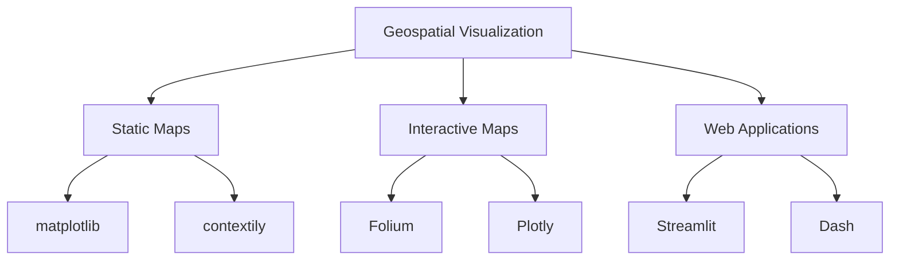
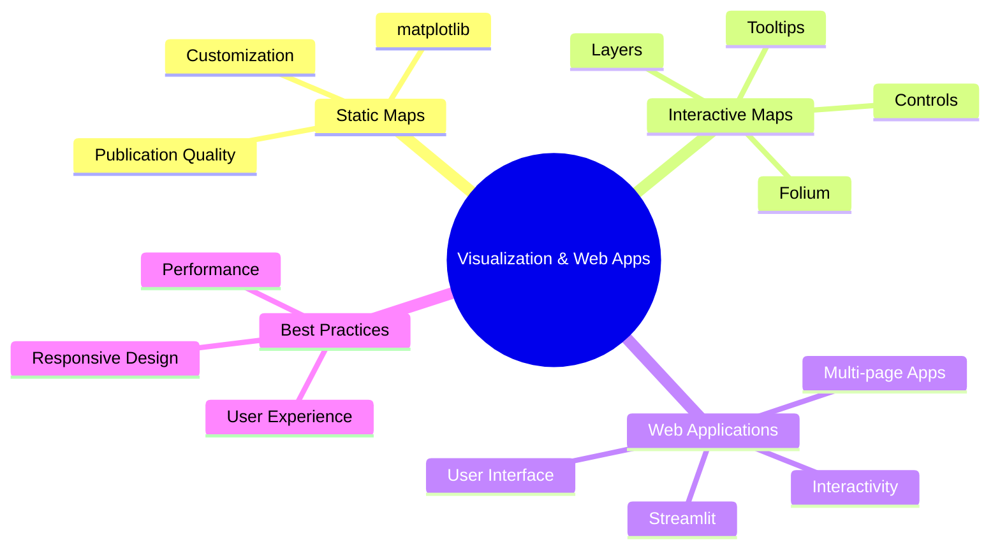
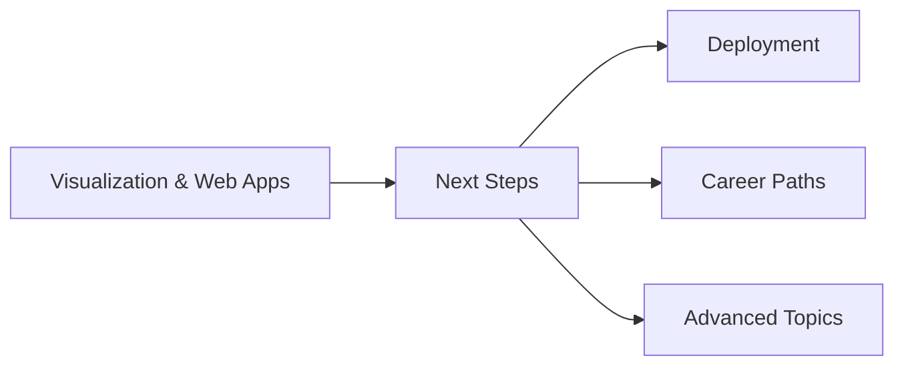

# Module 5: Visualization & Streamlit Web App

## Learning Goals
- Create static maps with matplotlib and contextily
- Build interactive maps with Folium
- Develop web applications using Streamlit
- Add user controls and interactivity
- Display analysis results in dashboards
- Deploy geospatial applications

## Introduction to Geospatial Visualization

Visualization is crucial for understanding and communicating geospatial analysis results. We'll explore both static and interactive approaches.



## Setting Up the Environment

```python
import geopandas as gpd
import pandas as pd
import matplotlib.pyplot as plt
import numpy as np
import folium
from folium import plugins
import streamlit as st
import plotly.express as px
import plotly.graph_objects as go
from plotly.subplots import make_subplots
import warnings
warnings.filterwarnings('ignore')

# Load sample data
world = gpd.read_file(gpd.datasets.get_path('naturalearth_lowres'))
cities = gpd.read_file(gpd.datasets.get_path('naturalearth_cities'))

print("=== DATA LOADED ===")
print(f"World countries: {len(world)}")
print(f"Cities: {len(cities)}")
```

## 1. Static Maps with Matplotlib

### Basic Static Maps

```python
# Create a comprehensive static map
fig, axes = plt.subplots(2, 2, figsize=(20, 16))

# 1. Basic world map
world.plot(ax=axes[0,0], color='lightblue', edgecolor='black', linewidth=0.5)
axes[0,0].set_title('World Countries', fontsize=14, fontweight='bold')
axes[0,0].set_xlabel('Longitude')
axes[0,0].set_ylabel('Latitude')

# 2. Choropleth map by population
world.plot(column='pop_est', ax=axes[0,1], legend=True, 
           cmap='YlOrRd', edgecolor='black', linewidth=0.3,
           legend_kwds={'label': 'Population Estimate'})
axes[0,1].set_title('World Population by Country', fontsize=14, fontweight='bold')

# 3. Cities with different sizes
world.plot(ax=axes[1,0], color='lightgray', edgecolor='black', linewidth=0.3)
cities.plot(ax=axes[1,0], markersize=cities['pop_max']/100000, 
           color='red', alpha=0.6)
axes[1,0].set_title('Cities Sized by Population', fontsize=14, fontweight='bold')

# 4. Focus on a specific region (Europe)
europe = world[world['continent'] == 'Europe']
europe_cities = cities[cities['continent'] == 'Europe']

europe.plot(ax=axes[1,1], color='lightgreen', edgecolor='black', linewidth=0.5)
europe_cities.plot(ax=axes[1,1], color='red', markersize=50, alpha=0.8)
axes[1,1].set_title('European Countries and Cities', fontsize=14, fontweight='bold')
axes[1,1].set_xlim(-25, 45)
axes[1,1].set_ylim(35, 75)

plt.tight_layout()
plt.show()
```

### Advanced Static Visualization

```python
# Create a publication-quality map
fig, ax = plt.subplots(1, 1, figsize=(16, 12))

# Plot countries with population-based colors
world_plot = world.plot(
    column='gdp_md_est',
    ax=ax,
    cmap='viridis',
    edgecolor='white',
    linewidth=0.5,
    legend=True,
    legend_kwds={
        'label': 'GDP (Million USD)',
        'orientation': 'horizontal',
        'shrink': 0.8,
        'pad': 0.1
    }
)

# Add cities
cities_plot = cities.plot(
    ax=ax,
    color='red',
    markersize=30,
    alpha=0.7,
    edgecolor='white',
    linewidth=0.5
)

# Customize the map
ax.set_title('World GDP and Major Cities', fontsize=18, fontweight='bold', pad=20)
ax.set_xlabel('Longitude', fontsize=12)
ax.set_ylabel('Latitude', fontsize=12)

# Remove axis ticks for cleaner look
ax.set_xticks([])
ax.set_yticks([])

# Add a subtle grid
ax.grid(True, alpha=0.3, linestyle='--')

# Set global extent
ax.set_xlim(-180, 180)
ax.set_ylim(-60, 80)

plt.tight_layout()
plt.show()
```

## 2. Interactive Maps with Folium

### Basic Interactive Map

```python
# Create a basic interactive map
def create_basic_folium_map():
    # Center the map on the world
    m = folium.Map(
        location=[20, 0],
        zoom_start=2,
        tiles='OpenStreetMap'
    )
    
    # Add country boundaries
    folium.GeoJson(
        world.to_json(),
        style_function=lambda feature: {
            'fillColor': 'lightblue',
            'color': 'black',
            'weight': 1,
            'fillOpacity': 0.5,
        }
    ).add_to(m)
    
    # Add major cities
    for idx, city in cities.head(20).iterrows():
        folium.CircleMarker(
            location=[city.geometry.y, city.geometry.x],
            radius=8,
            popup=f"<b>{city['name']}</b><br>Population: {city['pop_max']:,}",
            color='red',
            fill=True,
            fillColor='red',
            fillOpacity=0.7
        ).add_to(m)
    
    return m

# Create and display the map
basic_map = create_basic_folium_map()
print("Basic interactive map created!")

# In a Jupyter notebook, you would display with: basic_map
# For this demo, we'll save it
basic_map.save('basic_world_map.html')
print("Map saved as 'basic_world_map.html'")
```

### Advanced Interactive Map with Choropleth

```python
def create_choropleth_map():
    # Create choropleth map
    m = folium.Map(location=[20, 0], zoom_start=2)
    
    # Add choropleth layer
    folium.Choropleth(
        geo_data=world,
        name='Population',
        data=world,
        columns=['name', 'pop_est'],
        key_on='feature.properties.name',
        fill_color='YlOrRd',
        fill_opacity=0.7,
        line_opacity=0.2,
        legend_name='Population Estimate',
        highlight=True
    ).add_to(m)
    
    # Add tooltips with country information
    folium.GeoJson(
        world,
        style_function=lambda feature: {
            'fillColor': 'transparent',
            'color': 'transparent',
            'weight': 0,
        },
        tooltip=folium.GeoJsonTooltip(
            fields=['name', 'continent', 'pop_est', 'gdp_md_est'],
            aliases=['Country:', 'Continent:', 'Population:', 'GDP (M USD):'],
            localize=True,
            sticky=False,
            labels=True,
            style="""
                background-color: white;
                border: 2px solid black;
                border-radius: 3px;
                box-shadow: 3px;
            """,
            max_width=800,
        )
    ).add_to(m)
    
    # Add layer control
    folium.LayerControl().add_to(m)
    
    return m

choropleth_map = create_choropleth_map()
choropleth_map.save('choropleth_map.html')
print("Choropleth map saved as 'choropleth_map.html'")
```

### Interactive Map with Multiple Layers

```python
def create_multi_layer_map():
    # Create base map
    m = folium.Map(location=[20, 0], zoom_start=2)
    
    # Layer 1: Countries
    countries_layer = folium.FeatureGroup(name='Countries')
    folium.GeoJson(
        world,
        style_function=lambda feature: {
            'fillColor': 'lightblue',
            'color': 'black',
            'weight': 1,
            'fillOpacity': 0.3,
        },
        popup=folium.GeoJsonPopup(fields=['name', 'continent', 'pop_est'])
    ).add_to(countries_layer)
    
    # Layer 2: Major Cities
    cities_layer = folium.FeatureGroup(name='Major Cities')
    for idx, city in cities.head(50).iterrows():
        folium.CircleMarker(
            location=[city.geometry.y, city.geometry.x],
            radius=max(3, city['pop_max']/1000000),  # Size by population
            popup=f"""
            <b>{city['name']}</b><br>
            Country: {city['country']}<br>
            Population: {city['pop_max']:,}<br>
            Coordinates: {city.geometry.y:.2f}, {city.geometry.x:.2f}
            """,
            color='red',
            fill=True,
            fillColor='red',
            fillOpacity=0.7
        ).add_to(cities_layer)
    
    # Layer 3: Capitals (if available)
    capitals_layer = folium.FeatureGroup(name='Capital Cities')
    capital_cities = cities[cities['featurecla'] == 'Admin-0 capital']
    for idx, capital in capital_cities.iterrows():
        folium.Marker(
            location=[capital.geometry.y, capital.geometry.x],
            popup=f"<b>{capital['name']}</b><br>Capital of {capital['country']}",
            icon=folium.Icon(color='green', icon='star')
        ).add_to(capitals_layer)
    
    # Add all layers to map
    countries_layer.add_to(m)
    cities_layer.add_to(m)
    capitals_layer.add_to(m)
    
    # Add layer control
    folium.LayerControl().add_to(m)
    
    # Add fullscreen button
    plugins.Fullscreen().add_to(m)
    
    # Add measure tool
    plugins.MeasureControl().add_to(m)
    
    return m

multi_layer_map = create_multi_layer_map()
multi_layer_map.save('multi_layer_map.html')
print("Multi-layer map saved as 'multi_layer_map.html'")
```

## 3. Introduction to Streamlit

### Basic Streamlit App Structure

```python
# streamlit_app.py - Save this as a separate file
import streamlit as st
import geopandas as gpd
import pandas as pd
import folium
from streamlit_folium import st_folium
import plotly.express as px

# Page configuration
st.set_page_config(
    page_title="GeoPython Dashboard",
    page_icon="🌍",
    layout="wide",
    initial_sidebar_state="expanded"
)

# Title and description
st.title("🌍 GeoPython Interactive Dashboard")
st.markdown("""
This dashboard demonstrates geospatial data visualization and analysis using Python.
Use the sidebar to explore different features and datasets.
""")

# Load data
@st.cache_data
def load_data():
    world = gpd.read_file(gpd.datasets.get_path('naturalearth_lowres'))
    cities = gpd.read_file(gpd.datasets.get_path('naturalearth_cities'))
    return world, cities

world, cities = load_data()

# Sidebar
st.sidebar.header("🎛️ Controls")
st.sidebar.markdown("---")

# Dataset selection
dataset_option = st.sidebar.selectbox(
    "Choose Dataset:",
    ["World Countries", "Major Cities", "Both"]
)

# Continent filter
continents = ['All'] + sorted(world['continent'].unique().tolist())
selected_continent = st.sidebar.selectbox(
    "Filter by Continent:",
    continents
)

# Main content area
col1, col2 = st.columns([2, 1])

with col1:
    st.subheader("📊 Interactive Map")
    
    # Filter data based on selections
    if selected_continent != 'All':
        world_filtered = world[world['continent'] == selected_continent]
        cities_filtered = cities[cities['continent'] == selected_continent]
    else:
        world_filtered = world
        cities_filtered = cities
    
    # Create map based on selection
    if dataset_option == "World Countries":
        # Display countries only
        fig = px.choropleth(
            world_filtered,
            geojson=world_filtered.geometry,
            locations=world_filtered.index,
            color='pop_est',
            hover_name='name',
            hover_data=['continent', 'gdp_md_est'],
            color_continuous_scale='viridis',
            title=f"Population by Country - {selected_continent}"
        )
        st.plotly_chart(fig, use_container_width=True)
    
    elif dataset_option == "Major Cities":
        # Display cities only
        fig = px.scatter_geo(
            cities_filtered.head(100),
            lat=cities_filtered.head(100).geometry.y,
            lon=cities_filtered.head(100).geometry.x,
            size='pop_max',
            color='continent',
            hover_name='name',
            hover_data=['country', 'pop_max'],
            title=f"Major Cities - {selected_continent}"
        )
        st.plotly_chart(fig, use_container_width=True)
    
    else:  # Both
        # Create Folium map
        center_lat = world_filtered.geometry.centroid.y.mean()
        center_lon = world_filtered.geometry.centroid.x.mean()
        
        m = folium.Map(location=[center_lat, center_lon], zoom_start=2)
        
        # Add countries
        folium.GeoJson(
            world_filtered,
            style_function=lambda feature: {
                'fillColor': 'lightblue',
                'color': 'black',
                'weight': 1,
                'fillOpacity': 0.5,
            },
            tooltip=folium.GeoJsonTooltip(fields=['name', 'pop_est'])
        ).add_to(m)
        
        # Add cities
        for idx, city in cities_filtered.head(50).iterrows():
            folium.CircleMarker(
                location=[city.geometry.y, city.geometry.x],
                radius=5,
                popup=f"{city['name']}: {city['pop_max']:,}",
                color='red',
                fill=True
            ).add_to(m)
        
        # Display map
        st_folium(m, width=700, height=500)

with col2:
    st.subheader("📈 Statistics")
    
    # Display statistics
    if selected_continent != 'All':
        st.metric("Countries", len(world_filtered))
        st.metric("Cities", len(cities_filtered))
        st.metric("Total Population", f"{world_filtered['pop_est'].sum():,}")
        st.metric("Average GDP", f"${world_filtered['gdp_md_est'].mean():.0f}M")
    else:
        st.metric("Total Countries", len(world))
        st.metric("Total Cities", len(cities))
        st.metric("World Population", f"{world['pop_est'].sum():,}")
        st.metric("Average GDP", f"${world['gdp_md_est'].mean():.0f}M")
    
    # Top countries chart
    st.subheader("🏆 Top Countries by Population")
    top_countries = world_filtered.nlargest(10, 'pop_est')[['name', 'pop_est']]
    st.bar_chart(top_countries.set_index('name'))

# Footer
st.markdown("---")
st.markdown("Built with ❤️ using Streamlit and GeoPandas")
```

## 4. Advanced Streamlit Features

### Multi-Page Application

```python
# pages/01_🏠_Home.py
import streamlit as st

st.set_page_config(page_title="Home", page_icon="🏠")

st.title("🏠 GeoPython Workshop Dashboard")

st.markdown("""
## Welcome to the GeoPython Interactive Dashboard!

This multi-page application demonstrates various geospatial analysis and visualization techniques.

### 📚 What you'll find here:
- **🗺️ Map Explorer**: Interactive maps with multiple layers
- **📊 Data Analysis**: Statistical analysis of geographic data  
- **🎯 Spatial Analysis**: Buffer analysis and spatial operations
- **📈 Visualization**: Charts and graphs of geospatial data

### 🚀 Getting Started:
1. Use the sidebar to navigate between pages
2. Adjust controls to filter and customize visualizations
3. Explore different datasets and analysis options

### 🛠️ Technologies Used:
- **Streamlit**: Web application framework
- **GeoPandas**: Geospatial data manipulation
- **Folium**: Interactive mapping
- **Plotly**: Interactive charts
- **Matplotlib**: Static visualizations
""")

# Add some metrics
col1, col2, col3, col4 = st.columns(4)

with col1:
    st.metric("Countries", "195", "🌍")

with col2:
    st.metric("Cities", "1,249", "🏙️")

with col3:
    st.metric("Continents", "7", "🗺️")

with col4:
    st.metric("Analysis Tools", "15+", "🔧")
```

### Interactive Data Explorer

```python
# pages/02_🗺️_Map_Explorer.py
import streamlit as st
import geopandas as gpd
import folium
from streamlit_folium import st_folium
import plotly.express as px

st.set_page_config(page_title="Map Explorer", page_icon="🗺️", layout="wide")

st.title("🗺️ Interactive Map Explorer")

# Load data
@st.cache_data
def load_data():
    world = gpd.read_file(gpd.datasets.get_path('naturalearth_lowres'))
    cities = gpd.read_file(gpd.datasets.get_path('naturalearth_cities'))
    return world, cities

world, cities = load_data()

# Sidebar controls
st.sidebar.header("🎛️ Map Controls")

# Map type selection
map_type = st.sidebar.radio(
    "Choose Map Type:",
    ["Choropleth", "Scatter", "Combined"]
)

# Variable selection for choropleth
if map_type == "Choropleth":
    color_variable = st.sidebar.selectbox(
        "Color by:",
        ["pop_est", "gdp_md_est", "area_km2"],
        format_func=lambda x: {
            "pop_est": "Population",
            "gdp_md_est": "GDP (Million USD)",
            "area_km2": "Area (km²)"
        }[x]
    )

# Continent filter
continents = ['All'] + sorted(world['continent'].unique().tolist())
selected_continent = st.sidebar.selectbox("Filter by Continent:", continents)

# Filter data
if selected_continent != 'All':
    world_filtered = world[world['continent'] == selected_continent]
    cities_filtered = cities[cities['continent'] == selected_continent]
else:
    world_filtered = world
    cities_filtered = cities

# Main content
col1, col2 = st.columns([3, 1])

with col1:
    if map_type == "Choropleth":
        fig = px.choropleth(
            world_filtered,
            geojson=world_filtered.geometry,
            locations=world_filtered.index,
            color=color_variable,
            hover_name='name',
            hover_data=['continent', 'pop_est', 'gdp_md_est'],
            color_continuous_scale='viridis',
            title=f"{color_variable.replace('_', ' ').title()} by Country"
        )
        fig.update_layout(height=600)
        st.plotly_chart(fig, use_container_width=True)
    
    elif map_type == "Scatter":
        fig = px.scatter_geo(
            cities_filtered.head(200),
            lat=cities_filtered.head(200).geometry.y,
            lon=cities_filtered.head(200).geometry.x,
            size='pop_max',
            color='continent',
            hover_name='name',
            hover_data=['country', 'pop_max'],
            title="Major Cities by Population"
        )
        fig.update_layout(height=600)
        st.plotly_chart(fig, use_container_width=True)
    
    else:  # Combined
        # Create Folium map
        center_lat = world_filtered.geometry.centroid.y.mean()
        center_lon = world_filtered.geometry.centroid.x.mean()
        
        m = folium.Map(location=[center_lat, center_lon], zoom_start=2)
        
        # Add choropleth
        folium.Choropleth(
            geo_data=world_filtered,
            data=world_filtered,
            columns=['name', 'pop_est'],
            key_on='feature.properties.name',
            fill_color='YlOrRd',
            fill_opacity=0.7,
            line_opacity=0.2,
            legend_name='Population'
        ).add_to(m)
        
        # Add cities
        for idx, city in cities_filtered.head(100).iterrows():
            folium.CircleMarker(
                location=[city.geometry.y, city.geometry.x],
                radius=max(3, city['pop_max']/1000000),
                popup=f"<b>{city['name']}</b><br>Pop: {city['pop_max']:,}",
                color='red',
                fill=True,
                fillOpacity=0.8
            ).add_to(m)
        
        # Display map
        map_data = st_folium(m, width=700, height=600)

with col2:
    st.subheader("📊 Summary Statistics")
    
    # Display key metrics
    st.metric("Countries", len(world_filtered))
    st.metric("Cities", len(cities_filtered))
    
    if len(world_filtered) > 0:
        st.metric("Total Population", f"{world_filtered['pop_est'].sum():,}")
        st.metric("Avg GDP", f"${world_filtered['gdp_md_est'].mean():.0f}M")
    
    # Top countries
    st.subheader("🏆 Top 5 Countries")
    top_5 = world_filtered.nlargest(5, 'pop_est')[['name', 'pop_est']]
    for idx, row in top_5.iterrows():
        st.write(f"**{row['name']}**: {row['pop_est']:,}")
    
    # Continent distribution
    if selected_continent == 'All':
        st.subheader("🌍 By Continent")
        continent_counts = world['continent'].value_counts()
        st.bar_chart(continent_counts)
```

## 5. Spatial Analysis Dashboard

```python
# pages/03_🎯_Spatial_Analysis.py
import streamlit as st
import geopandas as gpd
import folium
from streamlit_folium import st_folium
import numpy as np

st.set_page_config(page_title="Spatial Analysis", page_icon="🎯", layout="wide")

st.title("🎯 Spatial Analysis Tools")

# Load data
@st.cache_data
def load_data():
    world = gpd.read_file(gpd.datasets.get_path('naturalearth_lowres'))
    cities = gpd.read_file(gpd.datasets.get_path('naturalearth_cities'))
    return world, cities

world, cities = load_data()

# Sidebar
st.sidebar.header("🔧 Analysis Tools")

analysis_type = st.sidebar.selectbox(
    "Choose Analysis:",
    ["Buffer Analysis", "Spatial Join", "Distance Analysis"]
)

if analysis_type == "Buffer Analysis":
    st.subheader("🔵 Buffer Analysis")
    
    # Buffer controls
    buffer_distance = st.sidebar.slider(
        "Buffer Distance (km):",
        min_value=50,
        max_value=1000,
        value=200,
        step=50
    )
    
    # Select cities for buffer analysis
    selected_cities = st.sidebar.multiselect(
        "Select Cities:",
        cities['name'].tolist()[:20],  # First 20 cities
        default=cities['name'].tolist()[:5]  # First 5 as default
    )
    
    if selected_cities:
        # Filter selected cities
        cities_subset = cities[cities['name'].isin(selected_cities)]
        
        # Create buffers (simplified - using degrees as approximation)
        cities_projected = cities_subset.to_crs('EPSG:3857')  # Web Mercator
        cities_buffered = cities_projected.copy()
        cities_buffered['geometry'] = cities_projected.geometry.buffer(buffer_distance * 1000)  # Convert km to m
        cities_buffered = cities_buffered.to_crs('EPSG:4326')  # Back to WGS84
        
        # Create map
        m = folium.Map(location=[20, 0], zoom_start=2)
        
        # Add world countries
        folium.GeoJson(
            world,
            style_function=lambda feature: {
                'fillColor': 'lightgray',
                'color': 'black',
                'weight': 0.5,
                'fillOpacity': 0.3,
            }
        ).add_to(m)
        
        # Add buffers
        for idx, city_buffer in cities_buffered.iterrows():
            folium.GeoJson(
                city_buffer.geometry,
                style_function=lambda feature: {
                    'fillColor': 'red',
                    'color': 'red',
                    'weight': 2,
                    'fillOpacity': 0.2,
                }
            ).add_to(m)
        
        # Add original cities
        for idx, city in cities_subset.iterrows():
            folium.CircleMarker(
                location=[city.geometry.y, city.geometry.x],
                radius=8,
                popup=f"<b>{city['name']}</b><br>{buffer_distance}km buffer",
                color='blue',
                fill=True,
                fillColor='blue'
            ).add_to(m)
        
        # Display map
        st_folium(m, width=700, height=500)
        
        # Analysis results
        st.subheader("📊 Buffer Analysis Results")
        
        col1, col2 = st.columns(2)
        
        with col1:
            st.metric("Selected Cities", len(selected_cities))
            st.metric("Buffer Distance", f"{buffer_distance} km")
            
            # Calculate total buffer area (approximate)
            total_buffer_area = len(selected_cities) * np.pi * (buffer_distance ** 2)
            st.metric("Total Buffer Area", f"{total_buffer_area:,.0f} km²")
        
        with col2:
            st.write("**Selected Cities:**")
            for city in selected_cities:
                st.write(f"• {city}")

elif analysis_type == "Spatial Join":
    st.subheader("🔗 Spatial Join Analysis")
    
    # Perform spatial join - cities within countries
    cities_countries = gpd.sjoin(cities, world, how='left', predicate='within')
    
    # Analysis options
    join_analysis = st.sidebar.selectbox(
        "Analysis Type:",
        ["Cities per Country", "Countries with Most Cities", "City Distribution"]
    )
    
    if join_analysis == "Cities per Country":
        # Count cities per country
        cities_per_country = cities_countries.groupby('name_right').size().sort_values(ascending=False)
        
        st.write("**Top 15 Countries by Number of Major Cities:**")
        st.bar_chart(cities_per_country.head(15))
        
        # Show detailed table
        st.subheader("📋 Detailed Results")
        detailed_results = cities_countries.groupby('name_right').agg({
            'name_left': 'count',
            'pop_max': ['sum', 'mean']
        }).round(0)
        
        detailed_results.columns = ['Number of Cities', 'Total City Population', 'Average City Population']
        st.dataframe(detailed_results.head(20))
    
    elif join_analysis == "Countries with Most Cities":
        # Create map showing countries colored by number of cities
        country_city_counts = cities_countries.groupby('name_right').size().reset_index()
        country_city_counts.columns = ['name', 'city_count']
        
        # Merge with world data
        world_with_counts = world.merge(country_city_counts, on='name', how='left')
        world_with_counts['city_count'] = world_with_counts['city_count'].fillna(0)
        
        # Create choropleth
        import plotly.express as px
        fig = px.choropleth(
            world_with_counts,
            geojson=world_with_counts.geometry,
            locations=world_with_counts.index,
            color='city_count',
            hover_name='name',
            hover_data=['continent', 'city_count'],
            color_continuous_scale='Reds',
            title="Number of Major Cities per Country"
        )
        fig.update_layout(height=600)
        st.plotly_chart(fig, use_container_width=True)

else:  # Distance Analysis
    st.subheader("📏 Distance Analysis")
    
    # Select two cities for distance calculation
    city_1 = st.sidebar.selectbox("Select First City:", cities['name'].tolist())
    city_2 = st.sidebar.selectbox("Select Second City:", cities['name'].tolist())
    
    if city_1 != city_2:
        # Get city coordinates
        city1_data = cities[cities['name'] == city_1].iloc[0]
        city2_data = cities[cities['name'] == city_2].iloc[0]
        
        # Calculate distance (simplified great circle distance)
        from geopy.distance import geodesic
        
        coord1 = (city1_data.geometry.y, city1_data.geometry.x)
        coord2 = (city2_data.geometry.y, city2_data.geometry.x)
        
        distance_km = geodesic(coord1, coord2).kilometers
        
        # Create map showing the two cities and connection
        m = folium.Map(location=[20, 0], zoom_start=2)
        
        # Add world countries
        folium.GeoJson(
            world,
            style_function=lambda feature: {
                'fillColor': 'lightgray',
                'color': 'black',
                'weight': 0.5,
                'fillOpacity': 0.3,
            }
        ).add_to(m)
        
        # Add cities
        folium.Marker(
            location=[city1_data.geometry.y, city1_data.geometry.x],
            popup=f"<b>{city_1}</b>",
            icon=folium.Icon(color='red', icon='star')
        ).add_to(m)
        
        folium.Marker(
            location=[city2_data.geometry.y, city2_data.geometry.x],
            popup=f"<b>{city_2}</b>",
            icon=folium.Icon(color='blue', icon='star')
        ).add_to(m)
        
        # Add line between cities
        folium.PolyLine(
            locations=[coord1, coord2],
            color='green',
            weight=3,
            opacity=0.8,
            popup=f"Distance: {distance_km:.0f} km"
        ).add_to(m)
        
        # Display map
        st_folium(m, width=700, height=500)
        
        # Display results
        col1, col2, col3 = st.columns(3)
        
        with col1:
            st.metric("Distance", f"{distance_km:.0f} km")
        
        with col2:
            st.metric("Distance", f"{distance_km * 0.621371:.0f} miles")
        
        with col3:
            # Approximate flight time (assuming 900 km/h)
            flight_time = distance_km / 900
            st.metric("Est. Flight Time", f"{flight_time:.1f} hours")
```

## Practice Problems

### Problem 1: Create a Population Dashboard
Build a comprehensive population analysis dashboard:

```python
# TODO:
# 1. Create a multi-page Streamlit app for population analysis
# 2. Include choropleth maps, bar charts, and statistics
# 3. Add filters for continent and population ranges
# 4. Include interactive features like hover tooltips
# 5. Add download functionality for filtered data

# Your code here
```

### Problem 2: Build a City Explorer
Create an interactive city exploration tool:

```python
# TODO:
# 1. Build a Streamlit app focused on city data
# 2. Include search functionality for cities
# 3. Show city details, nearby cities, and country information
# 4. Add comparison features between cities
# 5. Include interactive maps with custom markers

# Your code here
```

## Key Takeaways



!!! success "What You've Learned"
    - **Static Visualization**: Creating publication-quality maps with matplotlib
    - **Interactive Maps**: Building engaging maps with Folium
    - **Web Applications**: Developing dashboards with Streamlit
    - **User Interface**: Designing intuitive controls and layouts
    - **Data Integration**: Combining multiple datasets and analysis tools

!!! tip "Best Practices"
    - Keep user interfaces simple and intuitive
    - Provide clear feedback for user actions
    - Optimize performance with data caching
    - Make visualizations accessible and informative
    - Test applications with different screen sizes
    - Document functionality for users

## Next Steps

In the final module, we'll explore:
- Advanced deployment options
- Performance optimization
- Integration with other tools
- Career paths in geospatial Python
- Resources for continued learning

