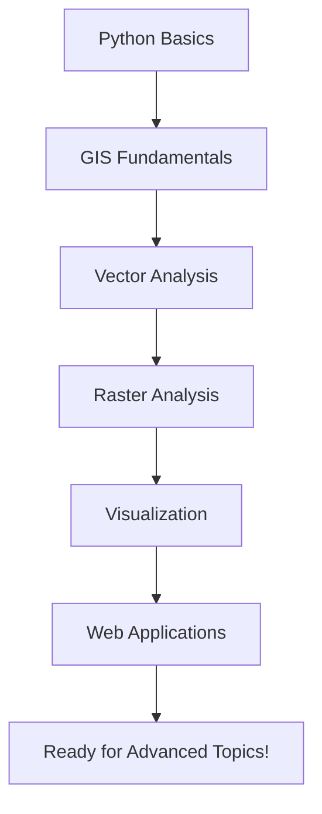
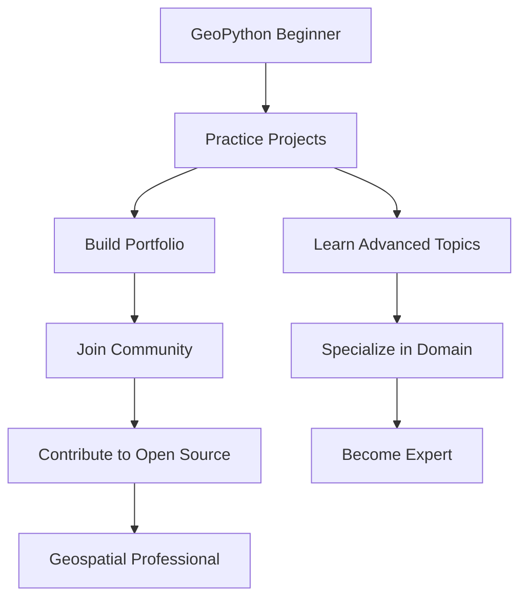

# Module 6: Next Steps & Learning Path

## Purpose
Guide participants on their continued journey in geospatial Python development, providing clear pathways for advancement and practical project ideas.

## What You've Accomplished

Congratulations! You've completed a comprehensive introduction to GeoPython. Let's review what you've learned:



### Skills Acquired ✅

!!! success "Core Python Skills"
    - Variables, data types, and control structures
    - Functions and code organization
    - Working with libraries (pandas, numpy)
    - Data manipulation and analysis

!!! success "GIS Fundamentals"
    - Vector vs raster data concepts
    - Coordinate reference systems
    - Spatial data formats and structures
    - Basic GIS terminology and concepts

!!! success "Geospatial Analysis"
    - GeoPandas for vector data manipulation
    - Rasterio for raster data processing
    - Spatial operations (buffers, intersections, joins)
    - Coordinate transformations and projections

!!! success "Visualization & Applications"
    - Static maps with matplotlib
    - Interactive maps with Folium
    - Web applications with Streamlit
    - Dashboard development and user interfaces

## Intermediate Python Topics

Now that you have the basics, here are the next Python concepts to master:

### 1. Advanced Python Programming

```python
# Object-Oriented Programming (OOP)
class SpatialAnalyzer:
    def __init__(self, data_path):
        self.data = gpd.read_file(data_path)
        self.crs = self.data.crs
    
    def buffer_analysis(self, distance):
        """Create buffers around geometries"""
        projected = self.data.to_crs('EPSG:3857')
        buffered = projected.geometry.buffer(distance)
        return gpd.GeoDataFrame(self.data, geometry=buffered, crs='EPSG:3857')
    
    def spatial_join(self, other_data):
        """Perform spatial join with another dataset"""
        return gpd.sjoin(self.data, other_data, predicate='intersects')

# Usage
analyzer = SpatialAnalyzer('countries.shp')
buffered_countries = analyzer.buffer_analysis(50000)  # 50km buffer
```

### 2. Error Handling and Debugging

```python
import logging

# Set up logging
logging.basicConfig(level=logging.INFO)
logger = logging.getLogger(__name__)

def safe_spatial_operation(gdf1, gdf2, operation='intersection'):
    """Safely perform spatial operations with error handling"""
    try:
        # Check CRS compatibility
        if gdf1.crs != gdf2.crs:
            logger.warning("CRS mismatch detected, reprojecting...")
            gdf2 = gdf2.to_crs(gdf1.crs)
        
        # Validate geometries
        if not gdf1.geometry.is_valid.all():
            logger.warning("Invalid geometries detected, fixing...")
            gdf1['geometry'] = gdf1.geometry.buffer(0)
        
        # Perform operation
        if operation == 'intersection':
            result = gpd.overlay(gdf1, gdf2, how='intersection')
        elif operation == 'union':
            result = gpd.overlay(gdf1, gdf2, how='union')
        else:
            raise ValueError(f"Unsupported operation: {operation}")
        
        logger.info(f"Operation completed successfully: {len(result)} features")
        return result
        
    except Exception as e:
        logger.error(f"Spatial operation failed: {str(e)}")
        return None

# Usage with error handling
result = safe_spatial_operation(countries, cities_buffered, 'intersection')
if result is not None:
    print(f"Success! {len(result)} intersecting features found")
```

### 3. Performance Optimization

```python
import time
from functools import wraps

def timing_decorator(func):
    """Decorator to measure function execution time"""
    @wraps(func)
    def wrapper(*args, **kwargs):
        start_time = time.time()
        result = func(*args, **kwargs)
        end_time = time.time()
        print(f"{func.__name__} took {end_time - start_time:.2f} seconds")
        return result
    return wrapper

@timing_decorator
def optimized_spatial_join(large_gdf, small_gdf):
    """Optimized spatial join using spatial index"""
    # Create spatial index for faster operations
    spatial_index = large_gdf.sindex
    
    # Use spatial index for initial filtering
    possible_matches_index = []
    for idx, geometry in small_gdf.geometry.items():
        possible_matches = list(spatial_index.intersection(geometry.bounds))
        possible_matches_index.extend([(idx, match) for match in possible_matches])
    
    # Perform actual spatial join only on potential matches
    # This is much faster than checking every combination
    return gpd.sjoin(small_gdf, large_gdf, predicate='intersects')

# Memory-efficient processing for large datasets
def process_large_dataset_in_chunks(file_path, chunk_size=1000):
    """Process large datasets in chunks to manage memory"""
    total_processed = 0
    
    # Read file info without loading all data
    with fiona.open(file_path) as src:
        total_features = len(src)
        
    # Process in chunks
    for chunk_start in range(0, total_features, chunk_size):
        chunk_end = min(chunk_start + chunk_size, total_features)
        
        # Read only the current chunk
        chunk_gdf = gpd.read_file(file_path, rows=slice(chunk_start, chunk_end))
        
        # Process chunk
        processed_chunk = chunk_gdf.buffer(1000)  # Example operation
        
        # Save or accumulate results
        output_file = f"processed_chunk_{chunk_start}_{chunk_end}.geojson"
        processed_chunk.to_file(output_file, driver='GeoJSON')
        
        total_processed += len(chunk_gdf)
        print(f"Processed {total_processed}/{total_features} features")
```

## Advanced GeoPandas Operations

### 1. Complex Spatial Analysis

```python
def advanced_spatial_analysis(countries, cities, rivers):
    """Perform complex multi-dataset spatial analysis"""
    
    # 1. Find countries with major rivers
    countries_with_rivers = gpd.sjoin(countries, rivers, predicate='intersects')
    river_countries = countries_with_rivers.groupby('name_left').agg({
        'name_right': 'count',  # Number of rivers
        'geometry': 'first'     # Keep geometry
    }).rename(columns={'name_right': 'river_count'})
    
    # 2. Calculate river density per country
    countries_proj = countries.to_crs('EPSG:3857')  # Equal area projection
    countries_proj['area_km2'] = countries_proj.geometry.area / 1_000_000
    
    river_density = river_countries.merge(
        countries_proj[['name', 'area_km2']], 
        left_index=True, 
        right_on='name'
    )
    river_density['river_density'] = river_density['river_count'] / river_density['area_km2']
    
    # 3. Find cities near major rivers (within 50km)
    rivers_buffered = rivers.to_crs('EPSG:3857')
    rivers_buffered['geometry'] = rivers_buffered.geometry.buffer(50_000)  # 50km
    rivers_buffered = rivers_buffered.to_crs('EPSG:4326')
    
    cities_near_rivers = gpd.sjoin(cities, rivers_buffered, predicate='within')
    
    # 4. Comprehensive analysis results
    analysis_results = {
        'countries_with_rivers': len(river_countries),
        'avg_rivers_per_country': river_countries['river_count'].mean(),
        'cities_near_rivers': len(cities_near_rivers),
        'top_river_density_countries': river_density.nlargest(5, 'river_density')[['name', 'river_density']]
    }
    
    return analysis_results, river_density, cities_near_rivers

# Usage
results, density_data, river_cities = advanced_spatial_analysis(world, cities, rivers)
print("Analysis Results:")
for key, value in results.items():
    print(f"  {key}: {value}")
```

### 2. Custom Spatial Functions

```python
def create_hexagonal_grid(bounds, hex_size):
    """Create a hexagonal grid over a given area"""
    from shapely.geometry import Polygon
    import math
    
    minx, miny, maxx, maxy = bounds
    
    # Hexagon parameters
    width = hex_size * 2
    height = hex_size * math.sqrt(3)
    
    hexagons = []
    row = 0
    
    y = miny
    while y < maxy:
        col = 0
        x = minx + (width * 3/4 * (row % 2))  # Offset every other row
        
        while x < maxx:
            # Create hexagon vertices
            vertices = []
            for i in range(6):
                angle = math.pi / 3 * i
                vertex_x = x + hex_size * math.cos(angle)
                vertex_y = y + hex_size * math.sin(angle)
                vertices.append((vertex_x, vertex_y))
            
            hexagon = Polygon(vertices)
            hexagons.append({
                'geometry': hexagon,
                'row': row,
                'col': col,
                'hex_id': f"hex_{row}_{col}"
            })
            
            x += width * 3/4
            col += 1
        
        y += height
        row += 1
    
    return gpd.GeoDataFrame(hexagons, crs='EPSG:4326')

def calculate_landscape_metrics(land_cover_gdf):
    """Calculate landscape ecology metrics"""
    from collections import Counter
    
    # Calculate patch statistics
    land_cover_stats = Counter(land_cover_gdf['land_cover_type'])
    
    # Calculate total area by land cover type
    land_cover_gdf_proj = land_cover_gdf.to_crs('EPSG:3857')
    land_cover_gdf_proj['area_km2'] = land_cover_gdf_proj.geometry.area / 1_000_000
    
    area_by_type = land_cover_gdf_proj.groupby('land_cover_type')['area_km2'].sum()
    
    # Calculate diversity metrics
    total_area = area_by_type.sum()
    proportions = area_by_type / total_area
    
    # Shannon diversity index
    shannon_diversity = -sum(p * math.log(p) for p in proportions if p > 0)
    
    # Simpson diversity index
    simpson_diversity = 1 - sum(p**2 for p in proportions)
    
    metrics = {
        'total_patches': len(land_cover_gdf),
        'land_cover_types': len(land_cover_stats),
        'total_area_km2': total_area,
        'shannon_diversity': shannon_diversity,
        'simpson_diversity': simpson_diversity,
        'area_by_type': area_by_type.to_dict(),
        'dominant_type': area_by_type.idxmax()
    }
    
    return metrics
```

## Raster Time-Series Analysis

### 1. Multi-temporal Analysis

```python
import xarray as xr
from datetime import datetime, timedelta

def analyze_raster_time_series(file_list, dates):
    """Analyze changes in raster data over time"""
    
    # Load all rasters into a time series
    raster_arrays = []
    for file_path in file_list:
        with rasterio.open(file_path) as src:
            raster_arrays.append(src.read(1))
    
    # Create xarray dataset for time series analysis
    time_series = xr.DataArray(
        raster_arrays,
        dims=['time', 'y', 'x'],
        coords={'time': dates}
    )
    
    # Calculate temporal statistics
    mean_over_time = time_series.mean(dim='time')
    std_over_time = time_series.std(dim='time')
    trend = time_series.polyfit(dim='time', deg=1)  # Linear trend
    
    # Detect significant changes
    change_threshold = std_over_time * 2  # 2 standard deviations
    significant_changes = (time_series.diff(dim='time').abs() > change_threshold).sum(dim='time')
    
    # Calculate change statistics
    total_change = time_series.isel(time=-1) - time_series.isel(time=0)
    change_rate = total_change / len(dates)
    
    results = {
        'mean_value': float(mean_over_time.mean()),
        'temporal_variability': float(std_over_time.mean()),
        'total_change': float(total_change.mean()),
        'change_rate_per_period': float(change_rate.mean()),
        'pixels_with_significant_change': int(significant_changes.sum()),
        'trend_slope': float(trend.polyfit_coefficients[0].mean())
    }
    
    return results, time_series

def detect_change_points(time_series_data, method='threshold'):
    """Detect change points in time series data"""
    
    if method == 'threshold':
        # Simple threshold-based change detection
        changes = []
        threshold = time_series_data.std() * 1.5
        
        for i in range(1, len(time_series_data)):
            if abs(time_series_data[i] - time_series_data[i-1]) > threshold:
                changes.append(i)
        
        return changes
    
    elif method == 'cusum':
        # Cumulative sum change detection
        mean_val = time_series_data.mean()
        cusum_pos = np.maximum.accumulate(np.maximum(0, time_series_data - mean_val - 2))
        cusum_neg = np.maximum.accumulate(np.maximum(0, -time_series_data + mean_val - 2))
        
        # Find change points where CUSUM exceeds threshold
        threshold = 5 * time_series_data.std()
        changes = np.where((cusum_pos > threshold) | (cusum_neg > threshold))[0]
        
        return changes.tolist()
```

## Web GIS Frameworks

### 1. Advanced Streamlit Applications

```python
# Advanced Streamlit app with caching and session state
import streamlit as st
from streamlit_folium import st_folium
import plotly.graph_objects as go
from plotly.subplots import make_subplots

class GeospatialApp:
    def __init__(self):
        self.setup_page_config()
        self.initialize_session_state()
    
    def setup_page_config(self):
        st.set_page_config(
            page_title="Advanced GeoPython Dashboard",
            page_icon="🌍",
            layout="wide",
            initial_sidebar_state="expanded"
        )
    
    def initialize_session_state(self):
        """Initialize session state variables"""
        if 'analysis_results' not in st.session_state:
            st.session_state.analysis_results = {}
        if 'selected_features' not in st.session_state:
            st.session_state.selected_features = []
    
    @st.cache_data
    def load_and_process_data(self, data_source):
        """Load and preprocess data with caching"""
        if data_source == 'world':
            data = gpd.read_file(gpd.datasets.get_path('naturalearth_lowres'))
            # Add calculated fields
            data['pop_density'] = data['pop_est'] / data['area_km2']
            data['gdp_per_capita'] = data['gdp_md_est'] * 1000000 / data['pop_est']
            return data
        # Add more data sources as needed
    
    def create_advanced_visualization(self, data, viz_type):
        """Create advanced visualizations"""
        if viz_type == 'multi_metric_dashboard':
            # Create subplot with multiple metrics
            fig = make_subplots(
                rows=2, cols=2,
                subplot_titles=('Population Density', 'GDP per Capita', 
                               'Area Distribution', 'Continental Comparison'),
                specs=[[{"type": "geo"}, {"type": "geo"}],
                       [{"type": "histogram"}, {"type": "bar"}]]
            )
            
            # Add choropleth maps
            fig.add_trace(
                go.Choropleth(
                    geojson=data.geometry.__geo_interface__,
                    locations=data.index,
                    z=data['pop_density'],
                    colorscale='Viridis',
                    name='Population Density'
                ),
                row=1, col=1
            )
            
            fig.add_trace(
                go.Choropleth(
                    geojson=data.geometry.__geo_interface__,
                    locations=data.index,
                    z=data['gdp_per_capita'],
                    colorscale='Plasma',
                    name='GDP per Capita'
                ),
                row=1, col=2
            )
            
            # Add histogram
            fig.add_trace(
                go.Histogram(x=data['area_km2'], name='Area Distribution'),
                row=2, col=1
            )
            
            # Add bar chart
            continent_stats = data.groupby('continent')['pop_est'].sum().sort_values(ascending=False)
            fig.add_trace(
                go.Bar(x=continent_stats.index, y=continent_stats.values, name='Population by Continent'),
                row=2, col=2
            )
            
            fig.update_layout(height=800, showlegend=False)
            return fig
    
    def run_spatial_analysis(self, analysis_type, parameters):
        """Run spatial analysis with progress tracking"""
        progress_bar = st.progress(0)
        status_text = st.empty()
        
        try:
            if analysis_type == 'buffer_intersection':
                status_text.text('Loading data...')
                progress_bar.progress(25)
                
                # Perform analysis steps
                status_text.text('Creating buffers...')
                progress_bar.progress(50)
                
                status_text.text('Calculating intersections...')
                progress_bar.progress(75)
                
                status_text.text('Finalizing results...')
                progress_bar.progress(100)
                
                # Store results in session state
                st.session_state.analysis_results[analysis_type] = {
                    'timestamp': datetime.now(),
                    'parameters': parameters,
                    'result_count': 42  # Example result
                }
                
                status_text.text('Analysis complete!')
                
        except Exception as e:
            st.error(f"Analysis failed: {str(e)}")
        finally:
            progress_bar.empty()
            status_text.empty()
    
    def create_interactive_map_with_drawing(self):
        """Create interactive map with drawing tools"""
        m = folium.Map(location=[40, -100], zoom_start=4)
        
        # Add drawing tools
        draw = plugins.Draw(
            export=True,
            filename='drawn_features.geojson',
            position='topleft',
            draw_options={
                'polyline': True,
                'polygon': True,
                'circle': True,
                'rectangle': True,
                'marker': True,
                'circlemarker': False,
            }
        )
        draw.add_to(m)
        
        # Add measurement tool
        plugins.MeasureControl().add_to(m)
        
        # Add fullscreen option
        plugins.Fullscreen().add_to(m)
        
        return m

# Usage
app = GeospatialApp()
world_data = app.load_and_process_data('world')

# Create advanced dashboard
st.title("🌍 Advanced Geospatial Analysis Dashboard")

# Sidebar controls
analysis_type = st.sidebar.selectbox(
    "Choose Analysis:",
    ["Multi-metric Dashboard", "Buffer Intersection", "Custom Analysis"]
)

if analysis_type == "Multi-metric Dashboard":
    fig = app.create_advanced_visualization(world_data, 'multi_metric_dashboard')
    st.plotly_chart(fig, use_container_width=True)

elif analysis_type == "Buffer Intersection":
    buffer_distance = st.sidebar.slider("Buffer Distance (km):", 10, 500, 100)
    
    if st.sidebar.button("Run Analysis"):
        app.run_spatial_analysis('buffer_intersection', {'distance': buffer_distance})
    
    # Display results if available
    if 'buffer_intersection' in st.session_state.analysis_results:
        results = st.session_state.analysis_results['buffer_intersection']
        st.success(f"Analysis completed at {results['timestamp']}")
        st.metric("Features Found", results['result_count'])
```

### 2. Flask-based Web Applications

```python
from flask import Flask, render_template, jsonify, request
import geopandas as gpd
import json

app = Flask(__name__)

# Load data once at startup
world_data = gpd.read_file(gpd.datasets.get_path('naturalearth_lowres'))

@app.route('/')
def index():
    return render_template('map.html')

@app.route('/api/countries')
def get_countries():
    """API endpoint to get country data"""
    continent = request.args.get('continent', 'all')
    
    if continent != 'all':
        filtered_data = world_data[world_data['continent'] == continent]
    else:
        filtered_data = world_data
    
    # Convert to GeoJSON
    geojson = json.loads(filtered_data.to_json())
    
    return jsonify(geojson)

@app.route('/api/analysis/buffer')
def buffer_analysis():
    """API endpoint for buffer analysis"""
    country_name = request.args.get('country')
    buffer_distance = float(request.args.get('distance', 100))
    
    # Find country
    country = world_data[world_data['name'] == country_name]
    
    if len(country) == 0:
        return jsonify({'error': 'Country not found'}), 404
    
    # Create buffer
    country_proj = country.to_crs('EPSG:3857')
    buffered = country_proj.geometry.buffer(buffer_distance * 1000)
    buffered_gdf = gpd.GeoDataFrame(country, geometry=buffered, crs='EPSG:3857')
    buffered_gdf = buffered_gdf.to_crs('EPSG:4326')
    
    # Return as GeoJSON
    return jsonify(json.loads(buffered_gdf.to_json()))

if __name__ == '__main__':
    app.run(debug=True)
```

## Cloud-Native Geospatial Data

### 1. Working with Cloud Optimized GeoTIFFs (COGs)

```python
import rasterio
from rasterio.session import AWSSession
import boto3

def access_cloud_optimized_geotiff(url):
    """Access and analyze Cloud Optimized GeoTIFF"""
    
    # Open COG directly from URL
    with rasterio.open(url) as src:
        # Read metadata without downloading entire file
        print(f"Shape: {src.shape}")
        print(f"CRS: {src.crs}")
        print(f"Bounds: {src.bounds}")
        print(f"Data type: {src.dtypes[0]}")
        
        # Read only a specific window (efficient!)
        window = rasterio.windows.Window(0, 0, 1000, 1000)  # Top-left 1000x1000 pixels
        data = src.read(1, window=window)
        
        return data, src.profile

def work_with_stac_catalog():
    """Work with SpatioTemporal Asset Catalog (STAC)"""
    import pystac_client
    
    # Connect to a STAC catalog
    catalog = pystac_client.Client.open("https://earth-search.aws.element84.com/v0")
    
    # Search for Landsat data
    search = catalog.search(
        collections=["landsat-8-l1"],
        bbox=[-74.2, 40.6, -73.7, 41.0],  # NYC area
        datetime="2023-01-01/2023-12-31",
        limit=10
    )
    
    items = list(search.get_items())
    print(f"Found {len(items)} Landsat scenes")
    
    # Access specific bands
    for item in items[:3]:  # First 3 items
        print(f"Scene: {item.id}")
        print(f"Date: {item.datetime}")
        
        # Get red band URL
        red_band_url = item.assets['B4'].href
        print(f"Red band URL: {red_band_url}")
        
        # You can now open this with rasterio
        # with rasterio.open(red_band_url) as src:
        #     red_data = src.read(1)

# Example usage
# cog_url = "https://example.com/path/to/data.tif"
# data, profile = access_cloud_optimized_geotiff(cog_url)
```

### 2. Dask for Large-Scale Processing

```python
import dask.dataframe as dd
import dask_geopandas

def process_large_geospatial_dataset():
    """Process large geospatial datasets with Dask"""
    
    # Read large dataset with Dask
    # This doesn't load data into memory immediately
    large_gdf = dask_geopandas.read_file("large_dataset.shp", npartitions=4)
    
    # Perform operations lazily
    # These operations are not executed until .compute() is called
    filtered = large_gdf[large_gdf['population'] > 100000]
    buffered = filtered.geometry.buffer(1000)
    
    # Execute computations
    result = buffered.compute()
    
    return result

def parallel_raster_processing():
    """Process rasters in parallel with Dask"""
    import dask.array as da
    import xarray as xr
    
    # Open multiple raster files as a Dask array
    files = ["raster1.tif", "raster2.tif", "raster3.tif"]
    
    # Create Dask array from raster files
    arrays = []
    for file in files:
        with rasterio.open(file) as src:
            arrays.append(da.from_array(src.read(), chunks=(1, 1000, 1000)))
    
    # Stack arrays along time dimension
    time_series = da.stack(arrays, axis=0)
    
    # Perform calculations (computed in parallel)
    mean_over_time = da.mean(time_series, axis=0)
    std_over_time = da.std(time_series, axis=0)
    
    # Compute results
    mean_result = mean_over_time.compute()
    std_result = std_over_time.compute()
    
    return mean_result, std_result
```

## Career Paths in Geospatial Python

### 1. GIS Analyst/Developer
**Skills to develop:**
- Advanced GeoPandas and spatial analysis
- Database management (PostGIS, SpatiaLite)
- Web mapping frameworks
- Automation and scripting

**Typical projects:**
- Spatial data processing pipelines
- Custom GIS tools and plugins
- Automated reporting systems
- Data quality assessment tools

### 2. Remote Sensing Specialist
**Skills to develop:**
- Rasterio and xarray for raster processing
- Machine learning for image classification
- Time series analysis
- Cloud computing platforms

**Typical projects:**
- Satellite image analysis
- Change detection studies
- Environmental monitoring
- Agricultural assessment

### 3. Geospatial Data Scientist
**Skills to develop:**
- Machine learning with scikit-learn
- Statistical analysis with scipy/statsmodels
- Big data processing with Dask
- Visualization with advanced libraries

**Typical projects:**
- Predictive modeling with spatial data
- Pattern recognition in geographic data
- Location intelligence applications
- Spatial optimization problems

### 4. Web GIS Developer
**Skills to develop:**
- Web frameworks (Flask, Django, FastAPI)
- JavaScript mapping libraries (Leaflet, Mapbox)
- RESTful API development
- Cloud deployment (AWS, Google Cloud, Azure)

**Typical projects:**
- Interactive web mapping applications
- Geospatial APIs and microservices
- Real-time location tracking systems
- Collaborative mapping platforms

## Suggested Project Ideas

### Beginner Projects (1-2 weeks)

1. **Local Business Mapper**
   - Geocode local businesses from addresses
   - Create interactive map with business categories
   - Add search and filter functionality

2. **Weather Station Analysis**
   - Download weather data from APIs
   - Analyze temperature and precipitation patterns
   - Create time series visualizations

3. **Transit Route Optimizer**
   - Use public transit data (GTFS)
   - Find optimal routes between locations
   - Visualize transit networks

### Intermediate Projects (1-2 months)

4. **Urban Heat Island Study**
   - Combine satellite imagery with weather data
   - Analyze temperature variations across urban areas
   - Create heat maps and statistical analysis

5. **Flood Risk Assessment**
   - Use elevation data and precipitation records
   - Model flood-prone areas
   - Create risk maps and evacuation routes

6. **Real Estate Price Predictor**
   - Combine property data with spatial features
   - Use machine learning for price prediction
   - Create interactive dashboard for results

### Advanced Projects (3-6 months)

7. **Wildfire Prediction System**
   - Integrate weather, vegetation, and historical fire data
   - Build machine learning models for fire risk
   - Create early warning system with web interface

8. **Smart City Dashboard**
   - Integrate multiple urban datasets (traffic, air quality, noise)
   - Real-time data processing and visualization
   - Predictive analytics for city planning

9. **Climate Change Impact Assessment**
   - Analyze long-term climate data trends
   - Model future scenarios
   - Create comprehensive reporting system

## Learning Resources

### Books 📚
- **"Python for Geospatial Data Analysis"** by Bonny P. McClain
- **"Geoprocessing with Python"** by Chris Garrard
- **"Learning Geospatial Analysis with Python"** by Joel Lawhead
- **"Automate the Boring Stuff with Python"** by Al Sweigart (general Python)

### Online Courses 🎓
- **Coursera**: GIS Specialization by UC Davis
- **edX**: Introduction to GIS by Penn State
- **Udemy**: Python for Geospatial Analysis
- **DataCamp**: Working with Geospatial Data in Python

### Documentation & Tutorials 📖
- [GeoPandas Documentation](https://geopandas.org/)
- [Rasterio Documentation](https://rasterio.readthedocs.io/)
- [Folium Documentation](https://python-visualization.github.io/folium/)
- [Streamlit Documentation](https://docs.streamlit.io/)

### Communities & Forums 👥
- **Stack Overflow**: [gis] and [python] tags
- **Reddit**: r/gis, r/Python, r/datascience
- **GitHub**: Explore geospatial Python repositories
- **Twitter**: Follow #geospacial, #python, #datascience hashtags

### Datasets for Practice 📊
- **Natural Earth**: Free vector and raster map data
- **OpenStreetMap**: Crowdsourced geographic data
- **NASA Earth Data**: Satellite imagery and climate data
- **US Census Bureau**: Demographic and boundary data
- **World Bank Open Data**: Global development indicators

### Conferences & Events 🎪
- **FOSS4G**: Free and Open Source Software for Geospatial
- **PyCon**: Python Conference (often has geospatial talks)
- **SciPy**: Scientific Python Conference
- **State of the Map**: OpenStreetMap Conference

## Building Your Portfolio

### 1. GitHub Portfolio
```markdown
# Your GeoPython Portfolio Structure

your-username/
├── README.md                 # Portfolio overview
├── project-1-business-mapper/
│   ├── README.md
│   ├── data/
│   ├── notebooks/
│   ├── src/
│   └── results/
├── project-2-weather-analysis/
│   ├── README.md
│   ├── data/
│   ├── notebooks/
│   └── visualizations/
└── learning-exercises/
    ├── geopandas-tutorials/
    ├── raster-analysis/
    └── web-mapping/
```

### 2. Documentation Best Practices
```python
def spatial_analysis_function(gdf, buffer_distance, crs='EPSG:3857'):
    """
    Perform buffer analysis on a GeoDataFrame.
    
    Parameters
    ----------
    gdf : geopandas.GeoDataFrame
        Input geographic data
    buffer_distance : float
        Buffer distance in meters
    crs : str, optional
        Coordinate reference system for analysis (default: 'EPSG:3857')
    
    Returns
    -------
    geopandas.GeoDataFrame
        GeoDataFrame with buffered geometries
    
    Examples
    --------
    >>> import geopandas as gpd
    >>> cities = gpd.read_file('cities.shp')
    >>> buffered = spatial_analysis_function(cities, 1000)
    >>> print(f"Created buffers for {len(buffered)} cities")
    """
    # Implementation here
    pass
```

### 3. Blog Posts and Tutorials
Consider writing about your projects:
- "How I Built a Real Estate Price Predictor with Python"
- "Analyzing Urban Heat Islands Using Satellite Data"
- "Creating Interactive Maps with Folium and Streamlit"

## Final Thoughts



### Remember:
!!! tip "Success Tips"
    - **Practice regularly**: Code a little bit every day
    - **Build projects**: Apply what you learn to real problems
    - **Share your work**: GitHub, blog posts, presentations
    - **Join communities**: Learn from others and help beginners
    - **Stay curious**: The geospatial field is constantly evolving
    - **Focus on problems**: Technology is just a tool to solve real-world issues

### Your Next Steps:
1. **Choose a project** from the suggested list above
2. **Set up your development environment** with the tools you've learned
3. **Start coding** and don't be afraid to make mistakes
4. **Document your progress** and share your results
5. **Connect with the community** and keep learning

Congratulations on completing the GeoPython workshop! You now have the foundation to build amazing geospatial applications and analyses. The journey is just beginning – go forth and map the world! 🌍🚀

---

*"The best way to learn is by doing. Start your first project today!"*