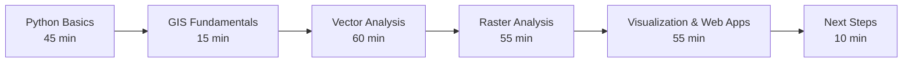
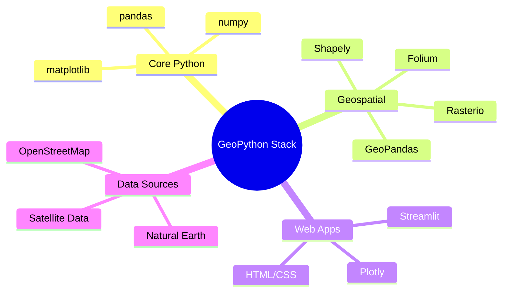

# GeoPython 101: 4-Hour Workshop

Welcome to **GeoPython 101** - a comprehensive introduction to Python for geospatial analysis and visualization! This workshop is designed for absolute beginners to Python with mixed GIS backgrounds.

## 🎯 Workshop Overview

This hands-on workshop will take you from Python basics to building interactive geospatial web applications in just 4 hours. You'll work with real-world datasets and create practical solutions using modern Python tools.

!!! info "Want More? Self-Paced Course Available!"
    Looking for a deeper dive into GeoPython with additional projects, advanced topics, and personalized support? Check out our comprehensive self-paced course at [krishnaglodha.com/courses](https://krishnaglodha.com/courses/)

## 📚 Workshop Modules

### [Module 1: Python Basics](01_python_basics.md)
- Variables, data types, and basic operations
- Lists, dictionaries, and control structures
- Functions and code organization
- Working with pandas for data analysis
- **Practice**: City population analysis

### [Module 2: GIS Fundamentals](02_gis_fundamentals.md)
- Vector vs Raster data concepts
- Coordinate Reference Systems (CRS)
- Loading and inspecting geospatial data
- Basic visualization techniques
- **Practice**: Exploring Natural Earth datasets

### [Module 3: Vector Data & Analysis](03_vector_analysis.md)
- GeoPandas and GeoDataFrames
- Spatial operations (buffers, intersections, joins)
- Attribute and spatial filtering
- Coordinate transformations
- **Practice**: European country analysis, spatial relationships

### [Module 4: Raster Data & Analysis](04_raster_analysis.md)
- Understanding raster structure and properties
- Raster calculations and statistics
- Clipping with vector boundaries
- Handling NoData values
- **Practice**: Elevation analysis, multi-criteria suitability

### [Module 5: Visualization & Web Apps](05_visualization.md)
- Static maps with matplotlib
- Interactive maps with Folium
- Building dashboards with leafmap
- User interface design
- **Practice**: Population dashboard, city explorer

### [Module 6: Next Steps & Learning Path](06_next_steps.md)
- Advanced Python and geospatial topics
- Career paths in geospatial Python
- Project ideas and resources
- Building your portfolio

## 🛠️ Prerequisites

- **No Python experience required** - we start from the basics!
- Basic computer literacy
- Familiarity with maps and geographic concepts (helpful but not required)
- **Environment**: Google Colab or Jupyter notebooks (no local installation needed)

## 📊 Datasets Used

All examples use **[Natural Earth](https://www.naturalearthdata.com/downloads/)** datasets that are freely available and included with GeoPandas:

- World countries boundaries
- Major cities and populated places
- Physical and cultural features

## 🎨 What You'll Build

By the end of this workshop, you'll have created:

!!! success "Workshop Deliverables"
    - **Interactive world map** with population data
    - **Spatial analysis tools** for buffer and intersection operations
    - **Raster analysis workflow** for elevation and terrain data
    - **Web dashboard** with user controls and visualizations
    - **Complete project portfolio** ready for GitHub

## 🚀 Key Technologies

## 💡 Learning Approach

This workshop follows a **hands-on, project-based approach**:

1. **Learn by Doing**: Every concept is immediately applied to real data
2. **Progressive Complexity**: Start simple, build up to advanced topics
3. **Real-World Examples**: Use actual geospatial datasets and scenarios
4. **Interactive Elements**: Build maps and apps you can interact with
5. **Best Practices**: Learn proper coding and documentation habits

## 🎯 Learning Outcomes

After completing this workshop, you will be able to:

!!! check "Technical Skills"
    - Write Python code for data analysis and visualization
    - Load, manipulate, and analyze geospatial data
    - Create both static and interactive maps
    - Build web applications for geospatial analysis
    - Handle coordinate reference systems and projections
    - Perform spatial operations and calculations

!!! check "Practical Applications"
    - Analyze population and demographic data
    - Create buffer zones and spatial relationships
    - Process elevation and terrain data
    - Build interactive dashboards
    - Share results through web applications

!!! check "Professional Development"
    - Understand geospatial Python ecosystem
    - Know where to find help and resources
    - Have a portfolio of projects to showcase
    - Be prepared for intermediate and advanced topics

## 🌟 Workshop Features

### 📝 Comprehensive Documentation
Each module includes:

- Clear explanations with diagrams
- Complete code examples with comments
- Practice problems with solutions
- Tips, tricks, and best practices
- Troubleshooting guides

### 🎮 Interactive Elements
- **Mermaid diagrams** for visual learning
- **Code blocks** with syntax highlighting
- **Collapsible solutions** for practice problems
- **Progress tracking** through modules

### 🔧 Practical Focus
- **Real datasets** from Natural Earth
- **Complete workflows** from data to visualization
- **Production-ready code** with error handling
- **Deployment examples** for sharing your work

## 🚦 Getting Started

Ready to begin your GeoPython journey? Here's how to start:

1. **Choose your environment**:
   
   - [Google Colab](https://colab.research.google.com/) (recommended for beginners)
   - [Jupyter notebooks](https://jupyter.org/) (if you have Python installed)
   - Local Python environment (for advanced users)

2. **Start with Module 1**: [Python Basics](01_python_basics.md)

3. **Follow along**: Copy and run all code examples

4. **Complete practice problems**: Test your understanding

5. **Build your portfolio**: Save your work for future reference

## 🤝 Community & Support

### Getting Help

- **Documentation**: Each module has detailed explanations
- **Practice Solutions**: All problems include complete solutions
- **Error Handling**: Common issues and fixes are covered
- **External Resources**: Links to official documentation

### Sharing Your Work

- **GitHub**: Create repositories for your projects
- **Social Media**: Share your maps and visualizations
- **Blog Posts**: Write about your learning journey
- **Community Forums**: Help other learners

## 📈 After the Workshop

This workshop is just the beginning! Here's what comes next:

### Immediate Next Steps

1. **Complete a personal project** using the skills learned
2. **Explore additional datasets** beyond Natural Earth
3. **Join geospatial Python communities** online
4. **Practice regularly** with small coding exercises

### Long-term Development

- **Advanced Topics**: Machine learning, big data processing
- **Specialization**: Remote sensing, urban planning, environmental analysis
- **Career Development**: GIS analyst, data scientist, web developer
- **Contribution**: Open source projects, teaching others

## 🎉 Let's Begin!

You're about to embark on an exciting journey into the world of geospatial Python programming. Whether you're looking to advance your career, solve real-world problems, or simply explore the intersection of geography and technology, this workshop will give you the foundation you need.

**Ready to start mapping with Python?**

[Begin with Module 1: Python Basics →](01_python_basics.md){ .md-button .md-button--primary }

---

!!! quote "Workshop Philosophy"
    *"The best way to learn programming is by solving real problems with real data. Every line of code in this workshop serves a purpose, and every concept builds toward creating something meaningful."*

**Happy coding, and welcome to the GeoPython community!** 🌍🐍✨